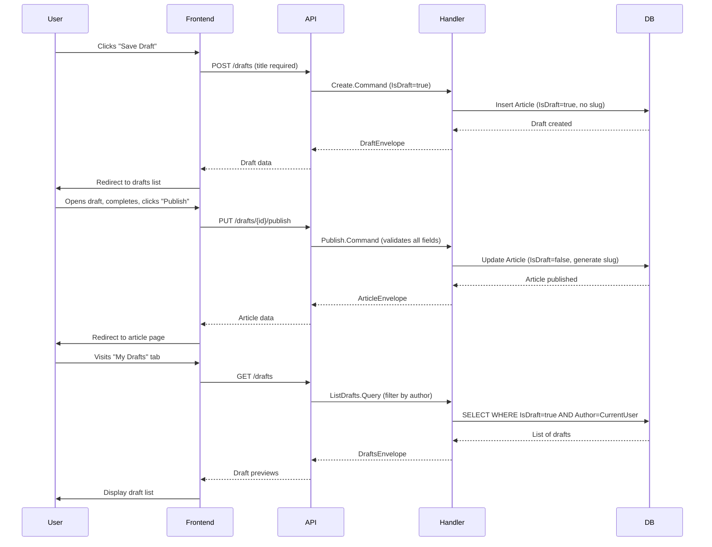

# Technical Implementation Plan: Article Drafts

## 1. Architecture & Strategy

### System Context
Article Drafts extends the existing article creation system to allow users to save incomplete articles for later completion. Drafts are stored in the same Article table with an `IsDraft` flag, enabling users to work iteratively without publishing prematurely. This feature integrates with the existing article editor, profile pages, and article management endpoints.

### Architecture Diagram


### Key Design Decisions
- **IsDraft Flag vs Separate Entity**: Use `IsDraft` boolean field on Article entity rather than separate Draft entity. Rationale: Drafts and articles share the same structure and behavior; publishing a draft is a simple state transition. Alternative (separate Draft entity) rejected due to duplication and complexity of migrating data between tables.
- **Slug Generation Strategy**: Generate slug only when publishing, not when saving draft. Drafts use numeric ID for routing. Rationale: Slug requires complete title and should be immutable once published; draft titles may change frequently during editing.
- **Draft-Specific Validation**: Use conditional validation in handlers based on IsDraft flag. Drafts require only title; published articles require title, description, and body. Rationale: Keeps validation logic centralized while supporting different requirements for draft vs published states.
- **Privacy Model**: Drafts filtered in List.Query to exclude from global/personal feeds and only visible in dedicated drafts endpoint. Rationale: Ensures drafts remain completely private without complex authorization logic.

### Data Flow Summary
1. **Create Draft**: User submits minimal article data (title + optional content) → Backend validates title only → Article saved with IsDraft=true, no slug → Redirect to drafts list
2. **Edit Draft**: User opens draft by numeric ID → Backend loads draft if author matches → User edits → Backend validates title only → UpdatedAt timestamp modified
3. **Publish Draft**: User completes draft content → Frontend sends publish request → Backend validates all required fields → IsDraft set to false, slug generated from title → Article appears in global feed
4. **List Drafts**: User visits profile drafts tab → Backend queries Articles WHERE IsDraft=true AND Author=CurrentUser → Returns ordered by UpdatedAt descending
5. **Delete Draft**: User deletes draft → Backend performs standard article deletion (same as published articles)

### Critical Patterns & Conventions

**Backend**:
- MediatR CQRS pattern for all operations (Command/Query + Handler)
- New namespace: `Conduit.Features.Drafts` for draft-specific operations
- FluentValidation with conditional rules based on IsDraft flag
- JWT authentication via `[Authorize]` attribute on all draft endpoints
- Unit tests in `backend/tests/Conduit.UnitTests/Features/Drafts/` mirroring feature structure
- Integration tests in `backend/tests/Conduit.IntegrationTests/Features/Drafts/`
- EF Core Migration to add `IsDraft` column (applied automatically at startup)
- Article.List.Query must filter WHERE IsDraft=false to exclude drafts from feeds

**Frontend**:
- Angular signals for reactive state management
- Standalone components with explicit imports
- Co-located unit tests (`.spec.ts` files alongside source)
- RxJS observables for API integration
- Reuse existing EditorComponent with conditional button rendering
- New ProfileDraftsComponent similar to ProfileArticlesComponent
- DraftsService following pattern of ArticlesService

---

## 2. Subtasks

### Subtask 1: Database Schema - Add IsDraft Flag
**Files**:
- Create: `backend/src/Conduit/Infrastructure/Migrations/<timestamp>_AddIsDraftToArticle.cs`
- Modify: `backend/src/Conduit/Domain/Article.cs`

**Description**:
Add `IsDraft` boolean column to Article entity. Default to false for existing articles. Migration auto-applies on startup.

**Edge Cases**:
- Existing published articles must have IsDraft=false after migration
- Slug can be null for drafts (modify Article.Slug to nullable if not already)
- Validation rules must check IsDraft before enforcing slug uniqueness

**Unit Tests**:
- None required (migrations tested via integration tests)

---

### Subtask 2: Backend - Modify Article List Query to Exclude Drafts
**Files**:
- Modify: `backend/src/Conduit/Features/Articles/List.cs`
- Modify: `backend/tests/Conduit.UnitTests/Features/Articles/ListHandlerTests.cs`
- Modify: `backend/tests/Conduit.IntegrationTests/Features/Articles/ListTests.cs`

**Description**:
Update List.QueryHandler to filter WHERE IsDraft=false in all scenarios (global feed, user feed, tag filter, author filter, favorited filter). Ensures drafts never appear in article lists.

**Edge Cases**:
- Feed queries must exclude drafts even when filtering by author (author's drafts should not appear in their public profile articles)
- Favorited articles filter should only show published articles (though users shouldn't be able to favorite drafts)
- Tag filtering must exclude drafts

**Unit Tests**:
- Test drafts excluded from global feed
- Test drafts excluded from user feed
- Test drafts excluded when filtering by author
- Test drafts excluded when filtering by tag
- Test drafts excluded when filtering by favorited username

---

### Subtask 3: Backend - Create Draft Creation Handler
**Files**:
- Create: `backend/src/Conduit/Features/Drafts/CreateDraft.cs`
- Create: `backend/tests/Conduit.UnitTests/Features/Drafts/CreateDraftHandlerTests.cs`
- Create: `backend/tests/Conduit.IntegrationTests/Features/Drafts/CreateDraftTests.cs`

**Description**:
Create handler for saving new draft. Similar to Articles/Create but with relaxed validation (title required, description/body/tags optional). Set IsDraft=true, no slug generation, use DateTime.UtcNow for timestamps.

**Edge Cases**:
- Empty title should fail validation
- Empty description/body/tags should be allowed
- No slug generation (slug remains null)
- CreatedAt and UpdatedAt both set to DateTime.UtcNow
- Author must be current authenticated user

**Unit Tests**:
- Test draft created with title only
- Test draft created with title and partial content
- Test draft created with all fields
- Test validation fails when title is null/empty
- Test tags added correctly when provided
- Test IsDraft flag set to true
- Test no slug generated
- Test timestamps set correctly

---

### Subtask 4: Backend - Create Draft Update Handler  
**Files**:
- Create: `backend/src/Conduit/Features/Drafts/EditDraft.cs`
- Create: `backend/tests/Conduit.UnitTests/Features/Drafts/EditDraftHandlerTests.cs`
- Create: `backend/tests/Conduit.IntegrationTests/Features/Drafts/EditDraftTests.cs`

**Description**:
Create handler for updating existing draft. Similar to Articles/Edit but validates IsDraft=true and allows partial updates. Update UpdatedAt timestamp, no slug generation.

**Edge Cases**:
- Must verify article exists and IsDraft=true (return 404 if not draft)
- Must verify current user is author (authorization check)
- Empty title should fail validation
- Partial updates allowed (null values mean "no change")
- UpdatedAt timestamp updated on each save
- Cannot edit published articles via draft endpoint

**Unit Tests**:
- Test draft updated successfully with partial data
- Test draft updated with all fields
- Test UpdatedAt timestamp changes
- Test validation fails when title set to empty
- Test tags updated correctly
- Test 404 when draft not found
- Test 404 when article is published (IsDraft=false)
- Test authorization (non-author cannot edit)

---

### Subtask 5: Backend - Create Draft Publishing Handler
**Files**:
- Create: `backend/src/Conduit/Features/Drafts/PublishDraft.cs`
- Create: `backend/tests/Conduit.UnitTests/Features/Drafts/PublishDraftHandlerTests.cs`
- Create: `backend/tests/Conduit.IntegrationTests/Features/Drafts/PublishDraftTests.cs`

**Description**:
Create handler for publishing draft to article. Validates all required fields (title, description, body), sets IsDraft=false, generates slug from title, keeps existing timestamps.

**Edge Cases**:
- Must verify article exists and IsDraft=true
- Must verify current user is author
- Must validate title, description, body all present and not empty
- Slug generated from current title using GenerateSlug()
- Slug collision possible (handle uniqueness constraint)
- IsDraft set to false
- UpdatedAt timestamp updated
- CreatedAt preserved from draft creation

**Unit Tests**:
- Test draft published successfully with all required fields
- Test validation fails when description missing
- Test validation fails when body missing
- Test slug generated from title
- Test IsDraft set to false
- Test UpdatedAt changed, CreatedAt preserved
- Test 404 when draft not found
- Test 404 when already published (IsDraft=false)
- Test authorization (non-author cannot publish)
- Test tags preserved during publish

---

### Subtask 6: Backend - Create Draft List Query Handler
**Files**:
- Create: `backend/src/Conduit/Features/Drafts/ListDrafts.cs`
- Create: `backend/tests/Conduit.UnitTests/Features/Drafts/ListDraftsHandlerTests.cs`
- Create: `backend/tests/Conduit.IntegrationTests/Features/Drafts/ListDraftsTests.cs`

**Description**:
Create handler for listing current user's drafts. Query Articles WHERE IsDraft=true AND Author=CurrentUser, ordered by UpdatedAt descending. Support pagination (limit/offset).

**Edge Cases**:
- Must require authentication (no anonymous access)
- Filter by current authenticated user only
- Order by UpdatedAt descending (most recently edited first)
- Support pagination (limit/offset parameters)
- Return empty list if user has no drafts
- Exclude published articles (IsDraft=false)

**Unit Tests**:
- Test returns only current user's drafts
- Test excludes published articles
- Test ordered by UpdatedAt descending
- Test pagination works (limit/offset)
- Test returns empty list when no drafts
- Test excludes other users' drafts

---

### Subtask 7: Backend - Create Draft Details Query Handler
**Files**:
- Create: `backend/src/Conduit/Features/Drafts/DraftDetails.cs`
- Create: `backend/tests/Conduit.UnitTests/Features/Drafts/DraftDetailsHandlerTests.cs`
- Create: `backend/tests/Conduit.IntegrationTests/Features/Drafts/DraftDetailsTests.cs`

**Description**:
Create handler for getting single draft by ID. Similar to Articles/Details but uses numeric ID instead of slug, validates IsDraft=true, enforces author-only access.

**Edge Cases**:
- Must use numeric ArticleId for lookup (no slug on drafts)
- Must verify IsDraft=true (return 404 if published)
- Must verify current user is author (return 403 if not)
- Must require authentication
- Return full draft data including tags

**Unit Tests**:
- Test returns draft for author
- Test 404 when draft not found
- Test 404 when article is published (IsDraft=false)
- Test 403 when non-author tries to access
- Test 401 when not authenticated
- Test tags included in response

---

### Subtask 8: Backend - Create Draft Delete Handler
**Files**:
- Create: `backend/src/Conduit/Features/Drafts/DeleteDraft.cs`
- Create: `backend/tests/Conduit.UnitTests/Features/Drafts/DeleteDraftHandlerTests.cs`
- Create: `backend/tests/Conduit.IntegrationTests/Features/Drafts/DeleteDraftTests.cs`

**Description**:
Create handler for deleting draft. Similar to Articles/Delete but uses numeric ID, validates IsDraft=true, enforces author-only access. Cascade deletes to ArticleTags.

**Edge Cases**:
- Must use numeric ArticleId for lookup
- Must verify IsDraft=true (cannot delete via draft endpoint if published)
- Must verify current user is author
- Cascade delete ArticleTags records
- No ArticleFavorites or Comments to clean up (drafts cannot be favorited or commented)

**Unit Tests**:
- Test draft deleted successfully by author
- Test ArticleTags deleted (cascade)
- Test 404 when draft not found
- Test 404 when article is published (IsDraft=false)
- Test 403 when non-author tries to delete
- Test 401 when not authenticated

---

### Subtask 9: Backend - Create Drafts API Controller
**Files**:
- Create: `backend/src/Conduit/Features/Drafts/DraftsController.cs`
- Merge tests: Use integration tests from subtasks 3-8

**Description**:
Create REST controller with endpoints for draft operations. All endpoints require [Authorize] attribute.

**Endpoints**:
- `POST /api/drafts` → CreateDraft.Command
- `GET /api/drafts` → ListDrafts.Query
- `GET /api/drafts/{id}` → DraftDetails.Query
- `PUT /api/drafts/{id}` → EditDraft.Command
- `PUT /api/drafts/{id}/publish` → PublishDraft.Command
- `DELETE /api/drafts/{id}` → DeleteDraft.Command

**Edge Cases**:
- All endpoints require authentication
- Route parameters use numeric {id:int} constraint
- Controller follows pattern of ArticlesController
- Uses MediatR mediator for handler dispatch

**Unit Tests**:
- Integration tests validate full request/response cycle (covered in handler tests)

---

### Subtask 10: Frontend - Create Drafts Service
**Files**:
- Create: `frontend/src/app/features/article/services/drafts.service.ts`
- Create: `frontend/src/app/features/article/services/drafts.service.spec.ts`

**Description**:
Create service for draft API integration. Follow pattern of ArticlesService. Methods for create, list, get, update, publish, delete.

**Methods**:
- `create(draft: Partial<Article>): Observable<Article>`
- `list(): Observable<{ drafts: Article[], draftsCount: number }>`
- `get(id: number): Observable<Article>`
- `update(id: number, draft: Partial<Article>): Observable<Article>`
- `publish(id: number): Observable<Article>`
- `delete(id: number): Observable<void>`

**Edge Cases**:
- All methods use authenticated HTTP requests
- Base URL: `/api/drafts`
- Publish returns full Article (not Draft)
- Error handling with proper HTTP status codes

**Unit Tests**:
- Test HTTP calls with correct endpoints
- Test authorization headers included
- Test request/response data mapping
- Test error handling

---

### Subtask 11: Frontend - Modify Editor Component for Drafts
**Files**:
- Modify: `frontend/src/app/features/article/pages/editor/editor.component.ts`
- Modify: `frontend/src/app/features/article/pages/editor/editor.component.html`
- Modify: `frontend/src/app/features/article/pages/editor/editor.component.spec.ts`

**Description**:
Add "Save Draft" button alongside "Publish Article" button. Detect if editing draft (route contains numeric ID) vs published article (route contains slug). Call appropriate service methods.

**Changes**:
- Add `isDraft` signal to track draft mode
- Add `draftId` signal for numeric ID when editing draft
- Add `saveDraft()` method calling draftsService.create() or draftsService.update()
- Add `publishDraft()` method calling draftsService.publish()
- Modify `submitForm()` to call publishArticle or publishDraft based on mode
- Add "Save Draft" button in template
- Modify ngOnInit to detect draft ID in route params
- Load draft using draftsService.get() when draft ID present

**Edge Cases**:
- Distinguish between draft ID (numeric) and article slug (string) in route
- Show "Save Draft" button only when creating new or editing draft
- Show only "Publish Article" when editing published article
- Validation: title required for saving draft, all fields for publishing
- Redirect to drafts list after saving draft
- Redirect to article page after publishing draft
- Handle slug collision errors on publish

**Unit Tests**:
- Test Save Draft button visible when creating new
- Test Save Draft button visible when editing draft
- Test Save Draft button hidden when editing published article
- Test saveDraft() calls create when no ID
- Test saveDraft() calls update when draft ID exists
- Test publishDraft() calls publish when draft ID exists
- Test submitForm() publishes draft when in draft mode
- Test submitForm() updates article when in article mode
- Test navigation after save/publish
- Test validation shown for missing fields

---

### Subtask 12: Frontend - Create Profile Drafts Component
**Files**:
- Create: `frontend/src/app/features/profile/components/profile-drafts.component.ts`
- Create: `frontend/src/app/features/profile/components/profile-drafts.component.spec.ts`

**Description**:
Create component to display user's drafts on profile page. Similar to ProfileArticlesComponent but uses DraftsService and shows drafts list. Only visible to draft author (isUser check).

**Features**:
- Call draftsService.list() on init
- Display draft previews (title, description, updatedAt, tags)
- Edit button navigates to `/editor/{draftId}`
- Delete button calls draftsService.delete()
- Show empty state: "No drafts yet. Start writing to save your work for later."
- Order by updatedAt descending

**Edge Cases**:
- Component only renders for current user's profile (use isUser signal)
- Other users' profiles should not show drafts tab
- Handle empty drafts list gracefully
- Confirm navigation away if unsaved editor changes
- Delete button should prompt confirmation (optional, but safer)

**Unit Tests**:
- Test drafts loaded on init
- Test draft previews displayed correctly
- Test empty state shown when no drafts
- Test edit navigation to correct route
- Test delete calls service and removes draft from list
- Test error handling for failed load/delete

---

### Subtask 13: Frontend - Add Drafts Tab to Profile Routes
**Files**:
- Modify: `frontend/src/app/features/profile/profile.routes.ts`
- Modify: `frontend/src/app/features/profile/pages/profile/profile.component.html`
- Modify: `frontend/src/app/features/profile/pages/profile/profile.component.ts`
- Modify: `frontend/src/app/features/profile/pages/profile/profile.component.spec.ts`

**Description**:
Add "My Drafts" tab to profile page navigation. Tab visible only when viewing own profile (use isUser check). Route to profile-drafts component.

**Changes**:
- Add route: `{ path: 'drafts', loadComponent: () => import('./components/profile-drafts.component') }`
- Add tab in profile.component.html after "Favorited Posts": `<a [routerLink]="['/profile', username, 'drafts']">My Drafts</a>`
- Wrap drafts tab in `@if (isUser())` conditional
- Tab should be third tab (after "My Posts" and "Favorited Posts")

**Edge Cases**:
- Tab only visible when user viewing own profile
- Tab hidden for other users' profiles
- Active state styling applied when on drafts route
- Route order matters (more specific routes first)

**Unit Tests**:
- Test drafts tab visible when viewing own profile
- Test drafts tab hidden when viewing other profile
- Test drafts tab navigation works
- Test active state styling applied correctly

---

### Subtask 14: Frontend - Add Draft Model and Update Article Model
**Files**:
- Modify: `frontend/src/app/features/article/models/article.model.ts`
- Create: `frontend/src/app/features/article/models/draft.model.ts` (optional, or reuse Article)

**Description**:
Add `isDraft` property to Article model. Alternatively, create separate Draft interface. Recommendation: reuse Article interface with optional isDraft.

**Changes**:
- Add `isDraft?: boolean` to Article interface
- Add `articleId?: number` to Article interface (for draft ID access)

**Edge Cases**:
- isDraft optional to maintain compatibility with existing code
- articleId needed for draft routing (slug not available for drafts)

**Unit Tests**:
- No direct tests (TypeScript interface), validated through component tests

---

### Subtask 15: Frontend - Update Editor Route to Support Draft ID
**Files**:
- Modify: `frontend/src/app/app.routes.ts`

**Description**:
Modify editor routes to support numeric draft ID in addition to article slug. Use regex constraint or route order to distinguish.

**Current Routes**:
```typescript
{
  path: 'editor',
  children: [
    { path: '', loadComponent: ... },
    { path: ':slug', loadComponent: ... }
  ]
}
```

**Changes**:
Keep existing routes. Editor component will detect draft ID (numeric) vs slug (string) using `route.snapshot.params['slug']` and TypeScript type checking.

**Edge Cases**:
- Route parameter name is 'slug' but value can be numeric ID or slug string
- Component logic must distinguish using `isNaN(Number(slug))`
- Draft IDs are numeric, slugs contain dashes and letters

**Unit Tests**:
- No route tests needed (validated through component integration tests)

---

## 3. Cross-Cutting Concerns

### Edge Cases & Pitfalls

**Authentication/Authorization**:
- All draft endpoints must require authentication (no anonymous access allowed)
- Draft access must be author-only (other users cannot see, edit, or delete another user's drafts)
- Published article endpoints must not allow accessing drafts (feeds, details, etc.)
- Frontend must handle 401/403 errors gracefully and redirect to login

**Data Integrity**:
- Slug must remain null until publication (do not generate slug for drafts)
- IsDraft flag must be checked in all article list queries (exclude drafts from public feeds)
- Publishing draft must validate all required fields before setting IsDraft=false
- UpdatedAt timestamp must update on every draft save
- CreatedAt timestamp must be preserved from draft creation through publication
- Tags must persist correctly when transitioning draft to published article
- Deleting draft must cascade to ArticleTags (no orphaned tags)

**Concurrency**:
- No optimistic locking implemented (last write wins)
- Concurrent edits of same draft by same user in multiple tabs will result in data loss
- Browser "Leave Site?" prompt should trigger when navigating away from editor with unsaved changes
- Slug collision possible when publishing draft if another article created with same title

**Validation**:
- Draft creation/update requires only title (description/body/tags optional)
- Article publication requires title, description, and body (full validation)
- Frontend must show appropriate validation errors for each action (save vs publish)
- Backend validation must be conditional based on IsDraft flag

**Routing & Navigation**:
- Drafts referenced by numeric ID (articleId), published articles by slug
- Editor must detect draft ID vs slug in route params
- Profile drafts tab must only appear for current user's profile
- Navigation after save/publish must go to appropriate destination (drafts list vs article page)

### Performance Considerations
- Draft list queries filter by IsDraft=true and Author=CurrentUser with index on both columns (add composite index in migration)
- Article list queries must filter WHERE IsDraft=false (add index on IsDraft column)
- No performance impact on existing article features if indexes added properly
- Draft list pagination (limit/offset) prevents loading excessive drafts

### Security Considerations
- Drafts must never appear in public feeds (global, user, tag, favorites)
- Draft detail endpoint must enforce author-only access (403 Forbidden for non-authors)
- Draft edit/delete/publish endpoints must verify current user is author
- Frontend must not display draft content or draft links to non-authors
- JWT token required for all draft operations (stateless authentication)
- No additional security measures needed beyond standard article auth pattern

---

## 4. Final Verification

> **Complete this checklist after all milestones are done**

### Build Verification
- [ ] Backend builds: `cd backend; dotnet build Conduit.sln` succeeds (0 errors)
- [ ] Backend unit tests: `cd backend; dotnet test tests/Conduit.UnitTests/` passes (all tests)
- [ ] Backend integration tests: `cd backend; dotnet test tests/Conduit.IntegrationTests/` passes (all tests)
- [ ] Frontend builds: `cd frontend; npm run build` succeeds (0 errors)
- [ ] Frontend unit tests: `cd frontend; npm run test -- --run` passes (all tests)

### Feature Verification (Manual Testing Required)
- [ ] Create new draft with title only → saves successfully, appears in drafts list
- [ ] Edit draft multiple times → updatedAt changes, content persists
- [ ] Publish draft with complete content → appears in global feed with slug
- [ ] Delete draft → removed from drafts list
- [ ] Drafts do not appear in global feed, user feed, or profile articles tab
- [ ] Non-authors cannot access another user's drafts (403 error)
- [ ] Guest users cannot create or view drafts (401 error)
- [ ] Browser warns when navigating away from editor with unsaved changes
- [ ] Profile "My Drafts" tab only visible on own profile
- [ ] Empty drafts list shows appropriate message

---

## 5. Dependencies & References

### Depends On
- Existing article creation/editing system
- Existing profile page structure
- JWT authentication infrastructure
- Entity Framework migrations system

### Depended On By
- None (this is a standalone feature extension)

### Related Documentation
- Feature spec: `.github/specs/article-drafts/spec.md`
- Related features: Articles (create, edit, delete), Profile pages
- Backend patterns: MediatR CQRS, FluentValidation, Entity Framework
- Frontend patterns: Angular signals, standalone components, RxJS observables
