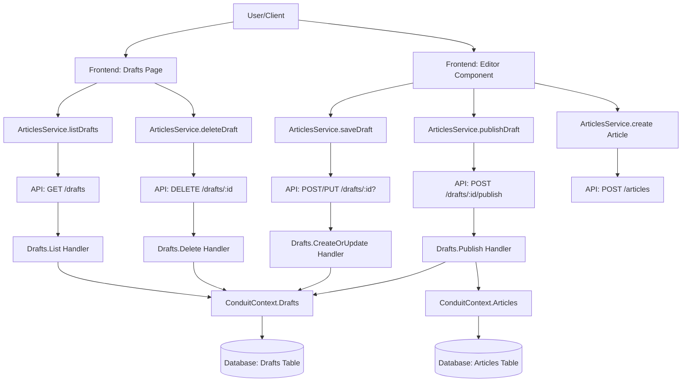

# Technical Implementation Plan: article-drafts

## 1. Architecture & Strategy

### System Context
The article-drafts feature extends the existing article creation/editing workflow to allow authors to save incomplete work privately before publishing. Drafts are stored as separate entities from published articles, isolated from all public queries (feeds, searches, tag lists). When a draft is published, it converts to a standard Article entity with a generated slug, and the draft is deleted.

### Architecture Diagram

### Key Design Decisions
- **Separate Draft Entity vs Article Status Field**: Use a separate `Draft` entity rather than adding an `IsPublished` or `Status` field to `Article`. This ensures drafts cannot accidentally leak into existing article queries, tag popularity calculations, or feed generation. It also simplifies authorization (all draft operations check `Draft.AuthorId` instead of navigating `Article.Author.PersonId`).
  
- **Draft ID-based Routing**: Drafts use integer `DraftId` for identification instead of slugs, since slugs are only generated upon publication. This avoids slug collision concerns during draft editing and aligns with the spec requirement that "Drafts do not generate slugs until published."

- **Publish as One-Way Conversion**: Publishing transforms a draft into a new Article entity and deletes the draft. This enforces the spec requirement that "Published articles cannot be converted back to drafts" and keeps the data model simple without bidirectional state transitions.

- **No Draft Sharing or Collaboration**: Drafts are strictly private (only accessible to author). No endpoints or UI exist for sharing draft links or previewing drafts as other users. This simplifies security and aligns with the spec's "Non-goals: Sharing draft previews with other users."

### Data Flow Summary
**Save Draft Flow**: User fills editor form → submits "Save as Draft" → frontend calls `POST /drafts` (create) or `PUT /drafts/:id` (update) → handler validates input → creates/updates Draft entity with `AuthorId = current user` → returns draft data with `DraftId` → frontend shows success message and continues editing.

**Publish Draft Flow**: User editing draft → clicks "Publish" → frontend calls `POST /drafts/:id/publish` → handler loads draft → validates ownership → creates new Article entity with slug generated from title → creates ArticleTags for tags → deletes Draft entity → returns published article → frontend redirects to article detail page.

**List Drafts Flow**: User navigates to "Drafts" page → frontend calls `GET /drafts` → handler queries drafts filtered by `AuthorId = current user` → orders by `UpdatedAt DESC` → returns list of drafts with metadata → frontend renders list with edit/delete buttons.

### Critical Patterns & Conventions

**Backend**:
- MediatR CQRS pattern for all operations (Command/Query + Handler in `Features/Drafts/` folder)
- FluentValidation for input validation (reuse validation rules similar to Article creation where applicable)
- JWT authentication via `[Authorize]` attribute on all draft endpoints
- Authorization check: Handlers must verify `draft.AuthorId == currentUser.PersonId` before edit/delete/publish operations
- Unit tests in `backend/tests/Conduit.UnitTests/Features/Drafts/` mirroring feature structure
- Integration tests in `backend/tests/Conduit.IntegrationTests/Features/Drafts/`
- EF Core Migration to add `Drafts` table and `DraftTags` join table (applied automatically at startup)

**Frontend**:
- Angular signals for reactive state management (`drafts = signal<Draft[]>([])`)
- Standalone components with explicit imports
- Co-located unit tests (`.spec.ts` files alongside source)
- RxJS observables for async API operations
- Service-based API integration via `ArticlesService` (add draft methods to existing service)
- Route guard: Drafts page requires authentication via `requireAuth` guard

---

## 2. Subtasks

### Milestone 1: Backend - Domain & Database

**File: `backend/src/Conduit/Domain/Draft.cs`**
- Create `Draft` entity class with properties: `DraftId` (int, PK), `Title`, `Description`, `Body`, `AuthorId` (FK to Person), `Author` (navigation), `CreatedAt`, `UpdatedAt`
- `DraftTags` collection (navigation property for many-to-many with Tag)
- No `Slug` property (slugs only exist on published articles)
- JsonIgnore on `DraftId` and `Author` navigation where appropriate
- NotMapped property `TagList` similar to Article

**File: `backend/src/Conduit/Domain/DraftTag.cs`**
- Create `DraftTag` join entity with composite key: `DraftId`, `TagId`
- Navigation properties: `Draft`, `Tag`

**File: `backend/src/Conduit/Infrastructure/ConduitContext.cs`**
- Add `DbSet<Draft> Drafts` and `DbSet<DraftTag> DraftTags`
- Configure `DraftTag` many-to-many relationship in `OnModelCreating` (similar to `ArticleTag` configuration)

**File: EF Core Migration**
- Run `dotnet ef migrations add AddDrafts --project backend/src/Conduit --startup-project backend/src/Conduit`
- Migration should create `Drafts` table with columns: `DraftId`, `Title`, `Description`, `Body`, `AuthorId`, `CreatedAt`, `UpdatedAt`
- Create `DraftTags` join table with composite PK (`DraftId`, `TagId`) and FKs to Drafts and Tags tables
- Migration applies automatically on app startup (existing behavior)

**Edge Cases:**
- Ensure `AuthorId` FK has cascade delete behavior (if user deleted, drafts deleted)
- `Title`, `Description`, `Body` should allow NULL in DB but validation enforces non-null on create
- `TagList` can be empty array (no tags required)

---

### Milestone 2: Backend - Create/Update Draft

**File: `backend/src/Conduit/Features/Drafts/CreateOrUpdate.cs`**
- Define `DraftData` record: `Title`, `Description`, `Body`, `TagList` (similar to `Create.ArticleData`)
- Define `Command` record: `DraftData Draft`, `int? DraftId` (null for create, populated for update)
- Validator: `DraftDataValidator` enforces `Title`, `Description`, `Body` are not null/empty (reuse similar validation from `Create.ArticleDataValidator`)
- Handler: `CreateOrUpdateHandler`
  - If `DraftId` is null: Create new draft, set `AuthorId = currentUser.PersonId`, set `CreatedAt = UpdatedAt = DateTime.UtcNow`, handle tags (create new tags if needed, reuse existing), return `DraftEnvelope`
  - If `DraftId` is not null: Load draft, verify `draft.AuthorId == currentUser.PersonId` (throw 403 if not), update fields, handle tag updates (add/remove `DraftTag` entries), set `UpdatedAt = DateTime.UtcNow`, return `DraftEnvelope`
  - Tag handling: Similar to `Create.Handler` and `Edit.Handler` for articles (find or create tags, manage join table)

**File: `backend/src/Conduit/Features/Drafts/DraftEnvelope.cs`**
- Define `DraftEnvelope` record containing `Draft` property
- Similar structure to `ArticleEnvelope` but for drafts

**File: `backend/tests/Conduit.UnitTests/Features/Drafts/CreateOrUpdateHandlerTests.cs`**
- Test: `Should_CreateDraft_WhenValidDataProvided` (verify draft created with correct fields, author assigned, tags associated)
- Test: `Should_CreateDraft_WithoutTags` (verify empty tag list works)
- Test: `Should_UpdateDraft_WhenValidDataProvided` (verify existing draft updated, `UpdatedAt` changed)
- Test: `Should_UpdateOnlyProvidedFields` (verify null fields in update don't overwrite existing data)
- Test: `Should_ThrowForbidden_WhenUpdatingOtherUsersDraft` (verify authorization)
- Test: `Should_ThrowNotFound_WhenUpdatingNonExistentDraft`
- Test: `Should_AddAndRemoveTags_WhenUpdating`

**File: `backend/tests/Conduit.UnitTests/Features/Drafts/CreateOrUpdateValidatorTests.cs`**
- Test: `Should_HaveError_WhenTitleIsNull`
- Test: `Should_HaveError_WhenDescriptionIsNull`
- Test: `Should_HaveError_WhenBodyIsNull`
- Test: `Should_NotHaveError_WhenTagListIsNull`

**Edge Cases:**
- Concurrent updates to same draft: Last write wins (no optimistic concurrency control per spec)
- Creating draft with same title as existing published article: Allowed (slug collision handled on publish)
- Creating draft with same title as another draft: Allowed (treated as separate drafts per spec)
- Updating deleted draft: Should return 404

---

### Milestone 3: Backend - List Drafts

**File: `backend/src/Conduit/Features/Drafts/List.cs`**
- Define `Query` record: No parameters needed (implicitly filtered by current user)
- Handler: `ListHandler`
  - Query `Drafts` filtered by `AuthorId == currentUser.PersonId`
  - Include `DraftTags` and `Tag` navigation properties (for `TagList`)
  - Order by `UpdatedAt DESC` (most recently updated first per spec)
  - Return `DraftsEnvelope` containing list of drafts

**File: `backend/src/Conduit/Features/Drafts/DraftsEnvelope.cs`**
- Define `DraftsEnvelope` record containing `List<Draft> Drafts` property

**File: `backend/tests/Conduit.UnitTests/Features/Drafts/ListHandlerTests.cs`**
- Test: `Should_ReturnOnlyCurrentUsersDrafts` (create drafts for multiple users, verify only current user's returned)
- Test: `Should_ReturnDraftsOrderedByUpdatedAtDesc` (create multiple drafts with different timestamps)
- Test: `Should_ReturnEmptyList_WhenNoDrafts`
- Test: `Should_IncludeTags_InDraftList`

**Edge Cases:**
- User has no drafts: Return empty list (not an error)
- Drafts from deleted users should not appear (handled by FK cascade delete)

---

### Milestone 4: Backend - Delete Draft

**File: `backend/src/Conduit/Features/Drafts/Delete.cs`**
- Define `Command` record: `int DraftId`
- Handler: `DeleteHandler`
  - Load draft by `DraftId` including `DraftTags` navigation
  - Verify `draft.AuthorId == currentUser.PersonId` (throw 403 if not)
  - Delete all associated `DraftTags` (cascade or explicit removal)
  - Delete `Draft` entity
  - Return success (void or empty response)

**File: `backend/tests/Conduit.UnitTests/Features/Drafts/DeleteHandlerTests.cs`**
- Test: `Should_DeleteDraft_WhenAuthorized`
- Test: `Should_DeleteAssociatedTags_WhenDeletingDraft`
- Test: `Should_ThrowForbidden_WhenDeletingOtherUsersDraft`
- Test: `Should_ThrowNotFound_WhenDraftDoesNotExist`

**Edge Cases:**
- Deleting draft while editing in another tab: Next save in other tab should return 404
- Deleting non-existent draft: Return 404
- Attempting to delete another user's draft: Return 403

---

### Milestone 5: Backend - Publish Draft

**File: `backend/src/Conduit/Features/Drafts/Publish.cs`**
- Define `Command` record: `int DraftId`
- Handler: `PublishHandler`
  - Load draft by `DraftId` including `Author` and `DraftTags`
  - Verify `draft.AuthorId == currentUser.PersonId` (throw 403 if not)
  - Generate slug from `draft.Title` using `GenerateSlug()` extension
  - Create new `Article` entity with:
    - Title, Description, Body copied from draft
    - Slug generated from title
    - Author = draft.Author
    - CreatedAt, UpdatedAt = DateTime.UtcNow
  - Create `ArticleTag` entries for each `DraftTag` (copy tags to published article)
  - Delete all `DraftTags`
  - Delete `Draft` entity
  - Save changes
  - Return `ArticleEnvelope` with published article

**File: `backend/tests/Conduit.UnitTests/Features/Drafts/PublishHandlerTests.cs`**
- Test: `Should_PublishDraft_AndCreateArticle`
- Test: `Should_GenerateSlug_FromDraftTitle`
- Test: `Should_CopyTags_FromDraftToArticle`
- Test: `Should_DeleteDraft_AfterPublishing`
- Test: `Should_ThrowForbidden_WhenPublishingOtherUsersDraft`
- Test: `Should_ThrowNotFound_WhenDraftDoesNotExist`
- Test: `Should_SetCreatedAtAndUpdatedAt_ToCurrentTime` (publishing is treated as new article creation)

**Edge Cases:**
- Publishing draft with title matching existing article slug: Slug generation should handle uniqueness (implementation may append numbers, e.g., "my-title-1", "my-title-2")
- Publishing in one tab while editing in another: Publish succeeds, edit tab shows 404 on next save
- Network error during publish transaction: Rollback ensures draft not deleted if article creation fails

---

### Milestone 6: Backend - Controller & Routes

**File: `backend/src/Conduit/Features/Drafts/DraftsController.cs`**
- Create `DraftsController` inheriting from `Controller`
- Add `[ApiController]`, `[Route("drafts")]`, `[Authorize]` attributes
- Endpoints:
  - `GET /drafts` → `List.Query` (returns `DraftsEnvelope`)
  - `POST /drafts` → `CreateOrUpdate.Command` with `DraftId = null` (returns `DraftEnvelope`)
  - `PUT /drafts/{id}` → `CreateOrUpdate.Command` with `DraftId = id` (returns `DraftEnvelope`)
  - `DELETE /drafts/{id}` → `Delete.Command` (returns 204 No Content)
  - `POST /drafts/{id}/publish` → `Publish.Command` (returns `ArticleEnvelope`)
- All endpoints require authentication (enforced by controller-level `[Authorize]`)

**File: `backend/tests/Conduit.IntegrationTests/Features/Drafts/DraftsIntegrationTests.cs`**
- Test: `CreateDraft_ShouldReturnCreatedDraft`
- Test: `UpdateDraft_ShouldReturnUpdatedDraft`
- Test: `ListDrafts_ShouldReturnOnlyUserDrafts`
- Test: `DeleteDraft_ShouldRemoveDraft`
- Test: `PublishDraft_ShouldCreateArticleAndRemoveDraft`
- Test: `UnauthenticatedRequest_ShouldReturn401`

**Edge Cases:**
- All draft endpoints require authentication (return 401 if not authenticated)
- Authorization enforced in handlers (return 403 if accessing other user's draft)

---

### Milestone 7: Frontend - Draft Model & Service

**File: `frontend/src/app/features/article/models/draft.model.ts`**
- Define `Draft` interface: `draftId`, `title`, `description`, `body`, `tagList`, `createdAt`, `updatedAt`
- Similar structure to `Article` but without `slug`, `author`, `favorited`, `favoritesCount`

**File: `frontend/src/app/features/article/services/articles.service.ts`**
- Add methods:
  - `listDrafts(): Observable<{ drafts: Draft[] }>` → `GET /drafts`
  - `getDraft(id: number): Observable<Draft>` → `GET /drafts/:id` (if needed, or load from list)
  - `saveDraft(draft: Partial<Draft>): Observable<Draft>` → `POST /drafts` (create) or `PUT /drafts/:id` (update)
  - `deleteDraft(id: number): Observable<void>` → `DELETE /drafts/:id`
  - `publishDraft(id: number): Observable<Article>` → `POST /drafts/:id/publish`
- Methods should map response envelopes to direct objects (e.g., `map(data => data.drafts)`)

**File: `frontend/src/app/features/article/services/articles.service.spec.ts`**
- Add tests for each new draft method (mock HttpClient, verify correct endpoints called, verify response mapping)

**Edge Cases:**
- Service methods should not handle authorization errors (let HTTP interceptor handle 401/403 and redirect)
- Empty drafts list should return `{ drafts: [] }`, not null

---

### Milestone 8: Frontend - Drafts List Page

**File: `frontend/src/app/features/article/pages/drafts/drafts.component.ts`**
- Standalone component with `requireAuth` guard
- Inject `ArticlesService`, `Router`
- On init: Call `articlesService.listDrafts()`, populate `drafts` signal
- Display loading state while fetching
- Display empty state if `drafts().length === 0`: "No drafts yet. Start writing!" with link to `/editor`
- Display list of drafts: For each draft, show title, description, updatedAt timestamp, tags, "Edit" button, "Delete" button
- Edit button: Navigate to `/editor/draft/:draftId`
- Delete button: Call `articlesService.deleteDraft(id)`, remove from list on success, show error on failure

**File: `frontend/src/app/features/article/pages/drafts/drafts.component.html`**
- Template structure:
  - Container with page title "Your Drafts"
  - Loading state: Spinner or "Loading drafts..."
  - Empty state: Message + link to create new article
  - Draft list: Each draft as a card/row with title (as link to edit), description, tags, timestamp, edit/delete buttons

**File: `frontend/src/app/features/article/pages/drafts/drafts.component.spec.ts`**
- Test: Should load and display drafts
- Test: Should show empty state when no drafts
- Test: Should navigate to editor when clicking edit
- Test: Should delete draft and update list

**File: `frontend/src/app/app.routes.ts`**
- Add route: `{ path: 'drafts', loadComponent: () => import('./features/article/pages/drafts/drafts.component'), canActivate: [requireAuth] }`

**Edge Cases:**
- Deleting draft should remove it from UI immediately (optimistic update)
- If delete fails, show error and restore draft to list
- Clicking draft title or edit button should navigate to draft editor

---

### Milestone 9: Frontend - Update Editor for Drafts

**File: `frontend/src/app/features/article/pages/editor/editor.component.ts`**
- Modify routing logic: Check for route param `draftId` in addition to `slug`
  - If `draftId` exists: Load draft via `articlesService.getDraft(draftId)` (or pass draft from drafts list), populate form, store `draftId` in component
  - If `slug` exists: Load article (existing behavior)
  - If neither: New article/draft
- Add "Save as Draft" button alongside "Publish Article" button
- Add `currentDraftId` signal to track whether editing a draft
- Modify `submitForm()`:
  - If user clicked "Save as Draft": Call `articlesService.saveDraft({ draftId: currentDraftId(), ...formData })`, show success message, update `currentDraftId` if new draft created, stay on editor page
  - If user clicked "Publish" and `currentDraftId()` exists: Call `articlesService.publishDraft(currentDraftId())`, navigate to article detail page
  - If user clicked "Publish" and no `currentDraftId()`: Call `articlesService.create()` (existing behavior)
- Add success message signal for "Draft saved successfully" (not just error messages)

**File: `frontend/src/app/features/article/pages/editor/editor.component.html`**
- Add "Save as Draft" button: `<button class="btn btn-default" (click)="saveDraft()">Save as Draft</button>`
- Keep existing "Publish Article" button: `<button class="btn btn-primary" (click)="submitForm()">Publish Article</button>` (or rename to `publishArticle()`)
- Show success message below errors: `@if (successMessage()) { 
{{ successMessage() }}
 }`

**File: `frontend/src/app/features/article/pages/editor/editor.component.spec.ts`**
- Test: Should save draft when "Save as Draft" clicked
- Test: Should publish draft when "Publish" clicked on draft editor
- Test: Should create article when "Publish" clicked on new article editor
- Test: Should load draft data when draftId in route
- Test: Should update existing draft when saving again

**File: `frontend/src/app/app.routes.ts`**
- Add route: `{ path: 'editor/draft/:draftId', loadComponent: () => import('./features/article/pages/editor/editor.component'), canActivate: [requireAuth] }`
- Keep existing routes: `editor` (new), `editor/:slug` (edit article)

**Edge Cases:**
- User clicks "Save as Draft" on published article editor (editing existing article by slug): Should not allow saving as draft (only "Publish Article" button should work). Alternatively, clarify in UI that "Save as Draft" only appears when creating new content or editing draft.
- User navigates away after clicking "Save as Draft": Changes are saved (no warning needed per spec)
- User navigates away without saving: Changes lost (consistent with existing behavior, no warning)
- After saving draft, update route to `/editor/draft/:draftId` so refresh doesn't lose context

---

### Milestone 10: Frontend - Add Drafts Link to Navigation

**File: `frontend/src/app/core/layout/header.component.html`**
- In authenticated user nav section, add "Drafts" link between "New Article" and "Settings" with icon (e.g., `ion-document`) and text "Drafts"
- Link should navigate to `/drafts` and use `routerLinkActive="active"` for highlighting
- Only show when `authState === 'authenticated'` (same condition as other authenticated links)
- Follow the same structure as existing nav items (list item with nav-link class)

**File: `frontend/src/app/core/layout/header.component.spec.ts`**
- Test: Should show Drafts link when authenticated
- Test: Should not show Drafts link when unauthenticated

**Edge Cases:**
- Drafts link should highlight (active state) when on `/drafts` page or editing draft (`/editor/draft/:id`)

---

## 3. Cross-Cutting Concerns

### Edge Cases & Pitfalls

**Authentication/Authorization**:
- All draft endpoints require authentication (401 if not logged in)
- All draft operations (edit, delete, publish) must verify `draft.AuthorId == currentUser.PersonId` (403 if not owner)
- Frontend should never receive other users' drafts from list endpoint (backend filters by author)
- Unauthenticated users should be redirected to login if attempting to access `/drafts` or `/editor/draft/:id` (handled by `requireAuth` guard)

**Data Integrity**:
- Publishing a draft must be atomic: Create article + create article tags + delete draft tags + delete draft in a single transaction. If any step fails, rollback entire operation to avoid orphaned drafts or partially published articles.
- Deleting a user should cascade delete all their drafts (enforce FK cascade delete on `Drafts.AuthorId`)
- Tags should be reused across drafts and articles (don't create duplicate tags with same name)
- Slug generation on publish must handle potential collisions with existing articles (e.g., "my-title" exists, generate "my-title-1")

**Concurrency**:
- Editing draft in multiple tabs: Last write wins (no optimistic locking). If draft deleted in tab A, saving in tab B returns 404.
- Publishing draft while editing: Publish succeeds, editor shows 404 on next save attempt.
- Creating multiple drafts with same title: Allowed (they're separate entities until published)

**Query Isolation**:
- Ensure existing article queries never accidentally include drafts:
  - Feeds (`GET /articles`, `GET /articles/feed`) query only `Articles` table, not `Drafts`
  - Tag popularity (`GET /tags`) should count only `ArticleTags`, not `DraftTags`
  - Profile articles (`GET /articles?author=...`) query only `Articles` table
  - Favorites (`GET /articles?favorited=...`) query only `Articles` table (drafts can't be favorited)
- No shared queries between `Drafts` and `Articles` tables (they're completely separate until publish)

**Validation Consistency**:
- Draft validation (title, description, body required) should match article validation to avoid surprises when publishing
- However, drafts should allow saving with validation errors in the future if auto-save is added (but current spec says auto-save is out of scope, so enforce same validation as articles)

### Performance Considerations
- Drafts list query should only load drafts for current user (don't load all drafts and filter client-side)
- Drafts list can be paginated in future if users have many drafts (but spec doesn't require pagination, so implement simple unpaginated list)
- Publishing should execute in a transaction to avoid partial state on errors

### Security Considerations
- Drafts are completely private; ensure no API endpoint exposes other users' drafts (even by accident through search, tags, or feeds)
- Draft IDs should not be guessable (use auto-increment integers, rely on authorization checks in handlers)
- When publishing, verify slug uniqueness to avoid overwriting existing articles (though DB should enforce unique slug constraint)

---

## 4. Final Verification

> **Complete this checklist after all milestones are done**

### Build Verification
- [ ] Backend builds: `cd backend; dotnet build Conduit.sln` succeeds (0 errors)
- [ ] Backend unit tests: `cd backend; dotnet test tests/Conduit.UnitTests/` passes (all tests)
- [ ] Backend integration tests: `cd backend; dotnet test tests/Conduit.IntegrationTests/` passes (all tests)
- [ ] Frontend builds: `cd frontend; npm run build` succeeds (0 errors)
- [ ] Frontend unit tests: `cd frontend; npm run test` passes (all tests)

### User Testing
After all automated tests pass, **ask the user to manually test** the workflows described in the spec (creating drafts, editing drafts, publishing drafts, deleting drafts, navigation). E2E tests should not be run as part of this feature implementation.

---

## 5. Dependencies & References

### Depends On
- Existing article creation/editing infrastructure (`Features/Articles/Create.cs`, `Edit.cs`)
- Existing authentication/authorization system (`ICurrentUserAccessor`, JWT)
- Existing tag management (reuse `Tag` entity for draft tags)
- Existing editor component UI (modify to add "Save as Draft" button)

### Depended On By
- Future auto-save feature (out of scope for this spec, but could build on this foundation)
- Future scheduled publishing (out of scope, would extend publish handler)

### Related Documentation
- Feature spec: `.github/specs/article-drafts/spec.md`
- Related features: Article creation (`.github/specs/articles/spec.md`), Article editing

