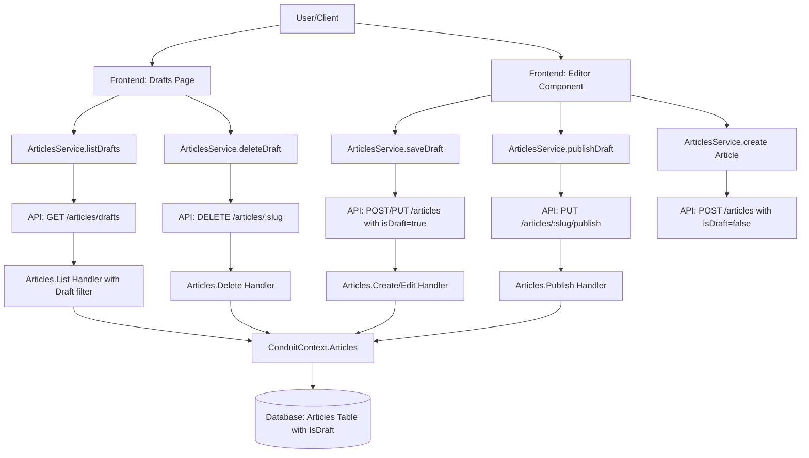

# Technical Implementation Plan: article-drafts

## 1. Architecture & Strategy

### System Context
The article-drafts feature extends the existing article creation/editing workflow to allow authors to save incomplete work privately before publishing. Drafts are stored as articles with an `IsDraft` boolean flag set to `true`, isolated from all public queries via boolean filtering. When a draft is published, the flag changes to `false` and the article becomes visible in feeds.

### Architecture Diagram

### Key Design Decisions
- **IsDraft Boolean Field**: Add an `IsDraft` boolean flag to the `Article` entity. This simplifies the data model (single entity, single tag relationship) and avoids data duplication. Fields and validation rules are identical for both states. `IsDraft = true` means draft, `IsDraft = false` means published.
  
- **Slug Generation Strategy**: Generate slugs immediately when creating draft articles (with IsDraft=true) to enable slug-based routing. Slugs may be regenerated if title changes before publishing. This provides consistent routing patterns for both drafts and published articles.

- **Query Filtering for Isolation**: All existing article queries (feeds, profiles, tags) must explicitly filter `WHERE IsDraft = false` to exclude drafts. This requires updating existing handlers and queries to prevent draft leakage. New "list drafts" queries filter `WHERE IsDraft = true AND AuthorId = currentUser`.

- **Publish as Boolean Flip**: Publishing changes `Article.IsDraft` from `true` to `false` (in-place update). This enforces the spec requirement that "Published articles cannot be converted back to drafts" through validation (disallow false→true transitions).

- **No Draft Sharing or Collaboration**: Drafts are strictly private (only accessible to author). Frontend never requests draft articles except through author-filtered queries. This aligns with the spec's "Non-goals: Sharing draft previews with other users."

### Data Flow Summary
**Save Draft Flow**: User fills editor form → submits "Save as Draft" → frontend calls `POST /articles` with `isDraft=true` (create) or `PUT /articles/:slug` with `isDraft=true` (update) → handler validates input → creates/updates Article entity with `IsDraft = true`, `Author = current user`, generates slug from title → returns article data with slug → frontend shows success message and continues editing.

**Publish Draft Flow**: User editing draft → clicks "Publish" → frontend calls `PUT /articles/:slug/publish` → handler loads article → validates ownership and IsDraft=true → updates `IsDraft = false`, updates `UpdatedAt = DateTime.UtcNow` → returns published article → frontend redirects to article detail page.

**List Drafts Flow**: User navigates to "Drafts" page → frontend calls `GET /articles/drafts` → handler queries articles filtered by `IsDraft = true AND AuthorId = current user` → orders by `UpdatedAt DESC` → returns list of draft articles → frontend renders list with edit/delete buttons.

### Critical Patterns & Conventions

**Backend**:
- MediatR CQRS pattern for all operations (extend existing `Features/Articles/` handlers, add new draft-specific handlers)
- FluentValidation for input validation (same rules for drafts and published articles)
- JWT authentication via `[Authorize]` attribute on all draft endpoints
- Authorization check: Handlers must verify `article.Author.PersonId == currentUser.PersonId` before edit/delete/publish operations on drafts
- **Critical**: Update ALL existing article query handlers to filter `WHERE IsDraft = false` to prevent draft leakage
- Unit tests in `backend/tests/Conduit.UnitTests/Features/Articles/` for draft-related handlers
- Integration tests in `backend/tests/Conduit.IntegrationTests/Features/Articles/`
- EF Core Migration to add `IsDraft` boolean column to `Articles` table (applied automatically at startup)

**Frontend**:
- Angular signals for reactive state management (`drafts = signal<Draft[]>([])`)
- Standalone components with explicit imports
- Co-located unit tests (`.spec.ts` files alongside source)
- RxJS observables for async API operations
- Service-based API integration via `ArticlesService` (add draft methods to existing service)
- Route guard: Drafts page requires authentication via `requireAuth` guard

---

## 2. Subtasks

### Milestone 1: Backend - Domain & Database

**File: `backend/src/Conduit/Domain/Article.cs`**
- Add `IsDraft` property: `public bool IsDraft { get; set; }` (default to `false` for backward compatibility)
- Add XML documentation: `/// 
Indicates if this article is a draft (true) or published (false). Drafts are private to the author.
`
- Ensure existing articles without explicit value are treated as published (IsDraft = false)

**File: EF Core Migration**
- Run `dotnet ef migrations add AddArticleIsDraft --project backend/src/Conduit --startup-project backend/src/Conduit`
- Migration should add `IsDraft` column to `Articles` table (type: bit/boolean, NOT NULL, default: 0/false for published)
- Update all existing articles to have `IsDraft = false` (published) as part of migration
- Migration applies automatically on app startup (existing behavior)

**Edge Cases:**
- Existing articles default to published (IsDraft = false) for backward compatibility
- IsDraft column NOT NULL to ensure every article has a defined state
- Database default value ensures old code paths create published articles

---

### Milestone 2: Backend - Update Existing Queries to Filter Published Articles

**Critical Step**: Update all existing article queries to explicitly filter for published articles only. This prevents drafts from leaking into public feeds, profiles, and tag lists.

**File: `backend/src/Conduit/Features/Articles/List.cs`**
- Update query to add filter: `WHERE IsDraft = false`
- Apply to both global feed and user feed queries

**File: `backend/src/Conduit/Features/Articles/Details.cs`**
- Update query to filter: `WHERE IsDraft = false OR (IsDraft = true AND Author.PersonId == currentUser.PersonId)`
- This allows authors to view their own drafts via slug, but prevents others from accessing

**File: `backend/src/Conduit/Features/Tags/List.cs`**
- Update tag popularity query to count only articles with `IsDraft = false`
- Ensure draft articles don't inflate tag popularity counts

**File: `backend/src/Conduit/Features/Profiles/Details.cs` (if separate profile article queries exist)**
- Update profile's articles query to filter `IsDraft = false` OR `(IsDraft = true AND viewing own profile)`

**File: `backend/tests/Conduit.UnitTests/Features/Articles/ListHandlerTests.cs`**
- Add test: `Should_ExcludeDraftArticles_FromGlobalFeed`
- Add test: `Should_ExcludeDraftArticles_FromUserFeed`

**File: `backend/tests/Conduit.UnitTests/Features/Articles/DetailsHandlerTests.cs`**
- Add test: `Should_AllowAuthor_ToViewOwnDraft`
- Add test: `Should_PreventOthers_FromViewingDraft`

**Edge Cases:**
- Authenticated vs unauthenticated access: Unauthenticated users should only see published articles (IsDraft = false)
- Author viewing own content: Authors can view their own drafts but not others' drafts
- Tag popularity: Only count published articles (IsDraft = false) to avoid revealing draft topics

---

### Milestone 3: Backend - Modify Create Handler to Support Draft Flag

**File: `backend/src/Conduit/Features/Articles/Create.cs`**
- Add optional `IsDraft` property to `ArticleData`: `public bool? IsDraft { get; init; }` (defaults to `false` if not provided)
- Update handler to set `article.IsDraft = message.Article.IsDraft ?? false`
- Generate slug from title immediately (even for drafts) to enable slug-based routing
- Validation remains the same (Title, Description, Body required for both drafts and published)

**File: `backend/tests/Conduit.UnitTests/Features/Articles/CreateHandlerTests.cs`**
- Add test: `Should_CreatePublishedArticle_WhenIsDraftNotProvided`
- Add test: `Should_CreateDraftArticle_WhenIsDraftIsTrue`
- Add test: `Should_GenerateSlug_ForDraftArticles`

**Edge Cases:**
- Backward compatibility: If IsDraft not provided, default to false/published (existing API behavior preserved)
- Slug generation for drafts: Slugs must be unique even for drafts (could have draft "my-title" and published "my-title")
- Draft articles should have all validations enforced (same as published)

---

### Milestone 4: Backend - Modify Edit Handler to Preserve Draft Flag

**File: `backend/src/Conduit/Features/Articles/Edit.cs`**
- Add authorization check: If article.IsDraft == true, verify `article.Author.PersonId == currentUser.PersonId` (throw 403 if not author)
- Published articles can only be edited by author (existing behavior)
- Draft articles can only be edited by author (new behavior)
- Editing should preserve the IsDraft field unless explicitly changed
- Add optional `IsDraft` to `ArticleData` if transitions are needed during edit (likely not for this milestone)

**File: `backend/tests/Conduit.UnitTests/Features/Articles/EditHandlerTests.cs`**
- Add test: `Should_PreserveIsDraft_WhenEditingDraft`
- Add test: `Should_PreserveIsDraft_WhenEditingPublished`
- Add test: `Should_ThrowForbidden_WhenNonAuthorEditsPublished`
- Add test: `Should_ThrowForbidden_WhenNonAuthorEditsDraft`

**Edge Cases:**
- Editing published article: Existing authorization checks apply
- Editing draft article: Must verify author ownership (prevent unauthorized edits)
- IsDraft transitions during edit: Not allowed in this milestone (use separate Publish endpoint)

---

### Milestone 5: Backend - List Drafts Query

**File: `backend/src/Conduit/Features/Articles/ListDrafts.cs`**
- Create new `ListDrafts` query handler (separate from List.cs to keep concerns distinct)
- Query: `WHERE IsDraft = true AND Author.PersonId == currentUser.PersonId`
- Include `Author`, `ArticleTags`, and `Tags` navigation properties
- Order by `UpdatedAt DESC` (most recently updated first)
- Return `ArticlesEnvelope` (reuse existing envelope, just filtered articles)

**File: `backend/tests/Conduit.UnitTests/Features/Articles/ListDraftsHandlerTests.cs`**
- Test: `Should_ReturnOnlyCurrentUsersDrafts`
- Test: `Should_ExcludePublishedArticles_FromDraftList`
- Test: `Should_ExcludeOtherUsersDrafts`
- Test: `Should_ReturnDraftsOrderedByUpdatedAtDesc`
- Test: `Should_ReturnEmptyList_WhenNoDrafts`

**Edge Cases:**
- User has no drafts: Return empty list
- User has both drafts and published articles: Only return drafts
- Unauthenticated request: Should be blocked by authorization (401)

---

### Milestone 6: Backend - Publish Draft Handler

**File: `backend/src/Conduit/Features/Articles/Publish.cs`**
- Create `Command` record: `string Slug` (identify article by slug)
- Create `PublishHandler`:
  - Load article by slug including Author navigation
  - Verify `article.IsDraft == true` (throw 400 if already published)
  - Verify `article.Author.PersonId == currentUser.PersonId` (throw 403 if not author)
  - Update `article.IsDraft = false`
  - Update `article.UpdatedAt = DateTime.UtcNow`
  - Save changes
  - Return `ArticleEnvelope` with published article

**File: `backend/tests/Conduit.UnitTests/Features/Articles/PublishHandlerTests.cs`**
- Test: `Should_PublishDraft_WhenAuthorized`
- Test: `Should_SetIsDraftToFalse_WhenPublishing`
- Test: `Should_UpdateUpdatedAt_WhenPublishing`
- Test: `Should_ThrowBadRequest_WhenArticleAlreadyPublished`
- Test: `Should_ThrowForbidden_WhenNonAuthorPublishes`
- Test: `Should_ThrowNotFound_WhenArticleDoesNotExist`

**Edge Cases:**
- Publishing already-published article: Return 400 Bad Request
- Publishing non-existent article: Return 404
- Publishing another user's draft: Return 403 Forbidden
- Concurrent publish attempts: Last write wins (acceptable per spec)

---

### Milestone 7: Backend - Controller Routes

**File: `backend/src/Conduit/Features/Articles/ArticlesController.cs`**
- Add endpoint: `GET /articles/drafts` → `ListDrafts.Query` (returns `ArticlesEnvelope` with drafts)
- Add endpoint: `PUT /articles/{slug}/publish` → `Publish.Command` (returns `ArticleEnvelope`)
- Existing endpoints work with modifications:
  - `POST /articles` with `isDraft=true` in body creates draft (Create.Command handles this)
  - `PUT /articles/{slug}` edits draft or published article (Edit.Command with authorization checks)
  - `DELETE /articles/{slug}` deletes draft or published article (Delete.Command with authorization checks)
- All endpoints remain under `[Authorize]` as appropriate

**File: `backend/tests/Conduit.IntegrationTests/Features/Articles/ArticleDraftsIntegrationTests.cs`**
- Test: `CreateDraft_ShouldReturnDraftArticle`
- Test: `ListDrafts_ShouldReturnOnlyUserDrafts`
- Test: `PublishDraft_ShouldSetIsDraftToFalse`
- Test: `EditDraft_ShouldPreserveIsDraft`
- Test: `DeleteDraft_ShouldRemoveArticle`
- Test: `PublishedArticles_ShouldNotAppearInDraftsList`

**Edge Cases:**
- Unauthenticated requests to draft endpoints: Return 401
- Creating article without isDraft: Defaults to false/published (backward compatibility)
- Filtering feeds must exclude drafts (already handled in Milestone 2)

---

### Milestone 8: Frontend - Draft Model & Service

**File: `frontend/src/app/features/article/models/article.model.ts`**
- Update `Article` interface to include optional `isDraft?: boolean` field
- Existing Article interface works for both drafts and published articles

**File: `frontend/src/app/features/article/services/articles.service.ts`**
- Add method: `listDrafts(): Observable<{ articles: Article[]; articlesCount: number }>` → `GET /articles/drafts`
- Add method: `publishArticle(slug: string): Observable<Article>` → `PUT /articles/:slug/publish`
- Modify `create()` method signature to accept optional `isDraft?: boolean` parameter (defaults to false for backward compatibility)
- Methods map response envelopes to direct objects (e.g., `map(data => data.articles)`)

**File: `frontend/src/app/features/article/services/articles.service.spec.ts`**
- Add test for `listDrafts()`: Mock HttpClient, verify `GET /articles/drafts` called, verify response mapping
- Add test for `publishArticle(slug)`: Mock HttpClient, verify `PUT /articles/:slug/publish` called
- Add test for `create()` with isDraft=true: Verify isDraft included in request body

**Edge Cases:**
- Creating article without isDraft defaults to false/published (backward compatibility)
- List drafts returns empty array if no drafts (not null)
- Service should not handle 401/403 errors (HTTP interceptor handles these)

---

### Milestone 9: Frontend - Drafts List Page

**File: `frontend/src/app/features/article/pages/drafts/drafts.component.ts`**
- Standalone component with `requireAuth` guard
- Inject `ArticlesService`, `Router`
- On init: Call `articlesService.listDrafts()`, populate `drafts` signal (signal of Article[])
- Display loading state while fetching
- Display empty state if `drafts().length === 0`: "No drafts yet. Start writing!" with link to `/editor`
- Display list of drafts: For each draft, show title, description, updatedAt timestamp, tags, "Edit" button, "Delete" button
- Edit button: Navigate to `/editor/:slug` (drafts now have slugs)
- Delete button: Call `articlesService.delete(slug)`, remove from list on success, show error on failure

**File: `frontend/src/app/features/article/pages/drafts/drafts.component.html`**
- Template structure:
  - Container with page title "Your Drafts"
  - Loading state: Spinner or "Loading drafts..."
  - Empty state: Message + link to create new article
  - Draft list: Each draft as a card/row with title (as link to edit), description, tags, timestamp (formatted updatedAt), edit/delete buttons

**File: `frontend/src/app/features/article/pages/drafts/drafts.component.spec.ts`**
- Test: Should load and display drafts
- Test: Should show empty state when no drafts
- Test: Should navigate to editor when clicking edit
- Test: Should delete draft and update list
- Test: Should display article properties (title, description, tags)

**File: `frontend/src/app/app.routes.ts`**
- Add route: `{ path: 'drafts', loadComponent: () => import('./features/article/pages/drafts/drafts.component'), canActivate: [requireAuth] }`

**Edge Cases:**
- Deleting draft should use existing `articlesService.delete(slug)` method (works for both drafts and published)
- Optimistic UI update: Remove draft from list immediately, restore on error
- Clicking draft title navigates to editor (not article detail page, since drafts shouldn't be viewable)

---

### Milestone 10: Frontend - Update Editor for Drafts

**File: `frontend/src/app/features/article/pages/editor/editor.component.ts`**
- Modify routing logic: Check for route param `slug`
  - If `slug` exists: Load article via `articlesService.get(slug)`, check if `isDraft === true`
  - Store `isDraft` signal to track whether editing draft vs published article
  - If neither: New article
- Add "Save as Draft" button (visible only when creating new article or editing draft)
- Add `isDraft` signal to track editing mode
- Create two submit methods:
  - `saveDraft()`: Call `articlesService.create({ ...formData, isDraft: true })` if new, or `articlesService.update({ ...formData, isDraft: true, slug })` if existing draft. Show success message, stay on editor. Update URL to `/editor/:slug` after first save if slug received.
  - `publishArticle()`: If `isDraft()`, call `articlesService.publishArticle(slug)`. If new article, call `articlesService.create({ ...formData, isDraft: false })`. Navigate to article detail on success.
- Add `successMessage` signal for "Draft saved successfully" notification

**File: `frontend/src/app/features/article/pages/editor/editor.component.html`**
- Add "Save as Draft" button (show only when creating new or editing draft): Button with click handler `saveDraft()`
- Keep existing "Publish Article" button with updated logic
- Show success message: Display success notification when draft saved

**File: `frontend/src/app/features/article/pages/editor/editor.component.spec.ts`**
- Test: Should save draft when "Save as Draft" clicked on new article
- Test: Should publish draft when "Publish" clicked while editing draft
- Test: Should create published article when "Publish" clicked on new article
- Test: Should load draft data when slug in route and isDraft is true
- Test: Should update existing draft when saving again
- Test: Should hide "Save as Draft" button when editing published article

**File: `frontend/src/app/app.routes.ts`**
- Keep existing routes: `editor` (new article), `editor/:slug` (edit article or draft)
- No new route needed since drafts use slugs now

**Edge Cases:**
- Editing published article: "Save as Draft" button should NOT appear (only "Publish Article")
- Creating new article: Both "Save as Draft" and "Publish Article" buttons visible
- Editing draft: Both buttons visible, "Publish Article" calls publish endpoint
- After saving draft first time, update URL from `/editor` to `/editor/:slug` so refresh works correctly
- User navigates away without saving: Changes lost (existing behavior, no warning per spec)

---

### Milestone 11: Frontend - Add Drafts Link to Navigation

**File: `frontend/src/app/core/layout/header.component.html`**
- In authenticated user nav section, add "Drafts" link between "New Article" and "Settings" with icon (e.g., `ion-document`) and text "Drafts"
- Link should navigate to `/drafts` and use `routerLinkActive="active"` for highlighting
- Only show when `authState === 'authenticated'` (same condition as other authenticated links)
- Follow the same structure as existing nav items (list item with nav-link class)

**File: `frontend/src/app/core/layout/header.component.spec.ts`**
- Test: Should show Drafts link when authenticated
- Test: Should not show Drafts link when unauthenticated
- Test: Should highlight Drafts link when on drafts page

**Edge Cases:**
- Drafts link should highlight when on `/drafts` page
- Link should not highlight when editing draft at `/editor/:slug` (unless specific routerLinkActive configuration added)

---

## 3. Cross-Cutting Concerns

### Edge Cases & Pitfalls

**Authentication/Authorization**:
- All draft operations (list, edit, publish) require authentication (401 if not logged in)
- Draft articles can only be edited/published by their author: Verify `article.Author.PersonId == currentUser.PersonId` (403 if not owner)
- Frontend should never request draft articles outside of the `/articles/drafts` endpoint
- Unauthenticated users should be redirected to login if attempting to access `/drafts` (handled by `requireAuth` guard)

**Data Integrity**:
- Publishing a draft must be atomic: Update status field in single transaction. Use EF Core transaction handling to ensure consistency.
- Deleting a user should cascade delete all their articles (both drafts and published via existing FK constraint)
- Tags are shared across drafts and published articles (don't create duplicate tags)
- Slug uniqueness enforced by database constraint (existing behavior, applies to drafts too since they have slugs)

**Concurrency**:
- Editing article in multiple tabs: Last write wins (no optimistic locking per spec). Status preserved unless explicitly changed.
- Publishing draft while editing in another tab: Publish succeeds, editor continues working (may accidentally update published article if they save after)
- Creating multiple drafts with same title: Each gets unique slug via slug generation logic

**Query Isolation (CRITICAL)**:
- **ALL existing article queries MUST add IsDraft filter**: This is the most error-prone aspect of this approach
  - List/Feed handlers: `WHERE IsDraft = false`
  - Details handler: `WHERE IsDraft = false OR (IsDraft = true AND Author.PersonId = currentUser)`
  - Tag popularity: Count only `WHERE IsDraft = false`
  - Profile articles: `WHERE IsDraft = false` (or allow author to see own drafts)
- Missing just ONE filter will leak drafts to public feeds - review all Article queries carefully
- Use helper methods or query extensions to standardize filtering: Consider `Articles.WherePublished()` extension method

**Validation Consistency**:
- Draft and published articles use identical validation (Title, Description, Body required)
- This prevents surprises when publishing (no additional validation failures)
- IsDraft transitions: Only allow true→false (draft to published), not false→true (enforce in Publish handler validation)

**Backward Compatibility**:
- Existing API endpoints continue to work: Creating article without isDraft defaults to false (published)
- Existing articles have `IsDraft = false` (published) set by migration
- Existing queries don't break, but MUST be updated to filter by IsDraft (this is a breaking change in behavior if not handled)

### Performance Considerations
- Add database index on `Articles.IsDraft` column to optimize filtering queries (especially for feeds and lists)
- Draft list query filtered by both `IsDraft` and `AuthorId`: Consider composite index `(IsDraft, AuthorId)` or `(AuthorId, IsDraft)`
- Tag popularity query now needs IsDraft filter: Ensure index supports `WHERE IsDraft = false` efficiently

### Security Considerations
- Drafts are private; ensure ALL public queries filter by IsDraft to prevent leakage
- IsDraft field is user-controlled input (via API): Validate allowed transitions (true→false OK, false→true blocked)
- Authorization checks must verify author ownership for draft operations (edit, publish, delete)
- Slug-based routing for drafts means slugs are potentially guessable: Rely on authorization checks, ensure 403 returned for non-owners

---

## 4. Final Verification

> **Complete this checklist after all milestones are done**

### Build Verification
- [ ] Backend builds: `cd backend; dotnet build Conduit.sln` succeeds (0 errors)
- [ ] Backend unit tests: `cd backend; dotnet test tests/Conduit.UnitTests/` passes (all tests)
- [ ] Backend integration tests: `cd backend; dotnet test tests/Conduit.IntegrationTests/` passes (all tests)
- [ ] Frontend builds: `cd frontend; npm run build` succeeds (0 errors)
- [ ] Frontend unit tests: `cd frontend; npm run test` passes (all tests)

### User Testing
After all automated tests pass, **ask the user to manually test** the workflows described in the spec (creating drafts, editing drafts, publishing drafts, deleting drafts, navigation). E2E tests should not be run as part of this feature implementation.

---

## 5. Dependencies & References

### Depends On
- Existing article creation/editing infrastructure (`Features/Articles/Create.cs`, `Edit.cs`, `Delete.cs`)
- Existing authentication/authorization system (`ICurrentUserAccessor`, JWT)
- Existing tag management (reuse `Tag` and `ArticleTag` entities for draft tags)
- Existing editor component UI (modify to add "Save as Draft" button)
- Existing Article entity and ArticlesController

### Depended On By
- Future auto-save feature (out of scope for this spec, but could build on status field foundation)
- Future scheduled publishing (out of scope, would work with Draft status articles)
- Future "unpublish" feature (could add Published→Draft transition, currently blocked)

### Related Documentation
- Feature spec: `.github/specs/article-drafts/spec.md`
- Related features: Article creation, Article editing, Article listing/filtering

