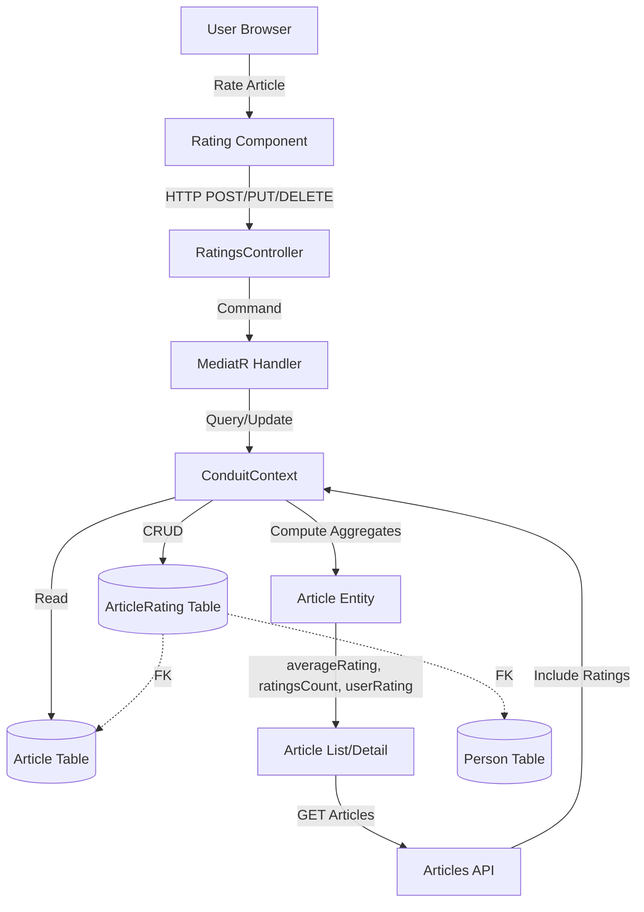

<!--
Technical implementation plans live at: .github/specs/<kebab-case-name>/plan.md

This plan provides HIGH-LEVEL strategic guidance for a capable AI agent to implement a feature.
Focus on architecture, approach, patterns, edge cases, and gotchas - NOT written out classes.

⚠️ CRITICAL: DO NOT INCLUDE:
- Full class or method implementations in code
- UI component templates or detailed styling
- E2E test generation
- E2E test validation steps (they will never pass) -> ask user instead to run E2E tests manually when everything else is done
-->

# Technical Implementation Plan: Article Ratings

## 1. Architecture & Strategy

### System Context
Article ratings extend the Article entity with a new many-to-many relationship (ArticleRating) between Person and Article, similar to ArticleFavorite. The feature calculates aggregate metrics (average rating, total count) and returns both aggregates and the current user's individual rating. Frontend components mirror the favorites pattern with rating controls on article previews and detail pages.

### Architecture Diagram

### Key Design Decisions
- **Entity Structure**: Create `ArticleRating` domain entity with composite key (ArticleId, PersonId) and `Stars` property (int 1-5), mirroring `ArticleFavorite` pattern for consistency
- **Aggregate Calculation**: Compute average and count as `[NotMapped]` properties on `Article` entity (calculated from `ArticleRatings` collection), similar to `FavoritesCount`
- **API Design**: Use RESTful pattern with three endpoints: POST `/articles/{slug}/rating` (set/update), DELETE `/articles/{slug}/rating` (clear), returning updated `ArticleEnvelope` after each operation
- **Frontend Pattern**: Create standalone `RatingControlComponent` similar to `FavoriteButtonComponent`, displaying both input (star selector) and output (average/count) with signal-based state management

### Data Flow Summary
User clicks star rating → component sends HTTP request (POST for set/update, DELETE for clear) → controller routes to MediatR handler → handler validates auth, retrieves article and person, creates/updates/deletes ArticleRating record → saves changes → reloads article with GetAllData (includes ratings collection) → calculates aggregates in Article entity → returns ArticleEnvelope → component updates UI with new average, count, and user's selected rating.

### Critical Patterns & Conventions

**Backend**:
- MediatR CQRS pattern: Separate commands (Set.cs, Clear.cs) with validators and handlers
- FluentValidation for input validation (slug required, stars 1-5 integer)
- JWT authentication via `[Authorize(AuthenticationSchemes = JwtIssuerOptions.Schemes)]` on controller endpoints
- Extend `ArticleExtensions.GetAllData()` to `.Include(x => x.ArticleRatings)` for aggregate calculation
- Use composite key (ArticleId, PersonId) in ConduitContext.OnModelCreating configuration
- Unit tests in `backend/tests/Conduit.UnitTests/Features/Ratings/` for validators and handlers
- Integration tests in `backend/tests/Conduit.IntegrationTests/Features/Ratings/` for end-to-end scenarios
- EF Core Migration for ArticleRating table (auto-applied on startup)

**Frontend**:
- Angular signals for reactive state (`isSubmitting`, `article` with updated ratings)
- Standalone component with explicit imports (NgClass, CommonModule, etc.)
- Co-located unit tests (`.spec.ts` files) for rating component and service methods
- RxJS observables in ArticlesService for async HTTP operations (setRating, clearRating)
- Display average rating formatted to 1 decimal place using Angular decimal formatting
- Disable controls during submission to prevent duplicate requests

---

## 2. Subtasks

### Backend Subtasks

#### Subtask 2.1: Domain Model & Database Schema
**Files**:
- `backend/src/Conduit/Domain/ArticleRating.cs` - New domain entity with ArticleId, PersonId, Stars properties
- `backend/src/Conduit/Domain/Article.cs` - Add ArticleRatings collection, AverageRating and RatingsCount computed properties
- `backend/src/Conduit/Domain/Person.cs` - Add ArticleRatings navigation collection
- `backend/src/Conduit/Infrastructure/ConduitContext.cs` - Add DbSet<ArticleRating>, configure composite key and relationships in OnModelCreating
- EF Core Migration file (auto-generated) - CREATE TABLE ArticleRatings with composite PK and FKs

**Edge Cases**:
- Ensure cascade delete: deleting Article should remove all its ArticleRating records
- Ensure cascade delete: deleting Person should remove all their ArticleRating records
- Average calculation must handle empty collection (return null or 0)
- Average must round to 1 decimal place using standard rounding conventions (round half up)

**Pitfalls**:
- Don't forget to include ArticleRatings in `ArticleExtensions.GetAllData()` or aggregates won't compute
- Stars property must be constrained 1-5 at database level (not just validation)

#### Subtask 2.2: Set/Update Rating Command
**Files**:
- `backend/src/Conduit/Features/Ratings/Set.cs` - Command, Validator, Handler to create or update rating
- `backend/tests/Conduit.UnitTests/Features/Ratings/SetValidatorTests.cs` - Validator unit tests
- `backend/tests/Conduit.UnitTests/Features/Ratings/SetHandlerTests.cs` - Handler unit tests

**Edge Cases**:
- User setting same rating again should be idempotent (update Stars to same value, no error)
- First rating on article (transition from null/0 to valid aggregate)
- User updating their own existing rating (replace Stars value, recalculate average)
- Unauthenticated user (handled by [Authorize] attribute, should 401)
- Article not found (should 404 with standard error)
- Invalid stars value outside 1-5 range (validator should catch, return 400)

**Pitfalls**:
- Must reload article with `.GetAllData()` after save to include updated ArticleRatings collection for aggregate calculation
- Handler must use `FirstOrDefault` to check if rating exists, then update or create accordingly

#### Subtask 2.3: Clear Rating Command
**Files**:
- `backend/src/Conduit/Features/Ratings/Clear.cs` - Command, Validator, Handler to delete rating
- `backend/tests/Conduit.UnitTests/Features/Ratings/ClearValidatorTests.cs` - Validator unit tests
- `backend/tests/Conduit.UnitTests/Features/Ratings/ClearHandlerTests.cs` - Handler unit tests

**Edge Cases**:
- Clearing non-existent rating should be no-op (don't throw error, just return current article state)
- Last rating being cleared should transition article back to null/0 aggregate
- Unauthenticated user (401 via [Authorize])
- Article not found (404)

**Pitfalls**:
- Must reload article with `.GetAllData()` after delete to recalculate aggregates

#### Subtask 2.4: API Controller
**Files**:
- `backend/src/Conduit/Features/Ratings/RatingsController.cs` - Controller with POST and DELETE endpoints

**Edge Cases**:
- Controller must enforce authentication on both endpoints
- Ensure route pattern matches: `/articles/{slug}/rating` (singular, not plural)

**Pitfalls**:
- Don't forget `[Authorize(AuthenticationSchemes = JwtIssuerOptions.Schemes)]` on both actions

#### Subtask 2.5: Backend Integration Tests
**Files**:
- `backend/tests/Conduit.IntegrationTests/Features/Ratings/SetTests.cs` - Full request/response tests for setting/updating
- `backend/tests/Conduit.IntegrationTests/Features/Ratings/ClearTests.cs` - Full request/response tests for clearing

**Edge Cases**:
- Test authenticated vs unauthenticated requests
- Test concurrent ratings from multiple users (average should be accurate)
- Test updating same rating multiple times
- Test clearing then re-setting rating

**Pitfalls**:
- Integration tests must set up test data (article, users) and clean up after

---

### Frontend Subtasks

#### Subtask 2.6: Article Model Extension
**Files**:
- `frontend/src/app/features/article/models/article.model.ts` - Add averageRating, ratingsCount, userRating properties to Article interface

**Edge Cases**:
- Model rating properties as nullable types where appropriate (average and user rating are null when no data exists)
- Ratings count should default to zero when no ratings exist
- User rating should be null for unauthenticated users or when user hasn't rated

#### Subtask 2.7: Articles Service Extension
**Files**:
- `frontend/src/app/features/article/services/articles.service.ts` - Add setRating(slug, stars) and clearRating(slug) methods
- `frontend/src/app/features/article/services/articles.service.spec.ts` - Unit tests for new methods

**Edge Cases**:
- setRating should accept stars 1-5, return Observable<Article>
- clearRating should return Observable<Article> (article after rating removed)
- Both should handle HTTP errors gracefully

**Pitfalls**:
- Ensure request body structure matches backend API expectation (wrap stars value appropriately)
- Unwrap ArticleEnvelope response to extract article data using standard RxJS transformation operators

#### Subtask 2.8: Rating Control Component
**Files**:
- `frontend/src/app/features/article/components/rating-control.component.ts` - Standalone component for star input/display
- `frontend/src/app/features/article/components/rating-control.component.spec.ts` - Unit tests

**Edge Cases**:
- Must show aggregate (average + count) to all users
- Must show interactive star selector only to authenticated users
- Must disable stars while request is in progress to prevent duplicate submissions
- Clicking selected star should clear rating (or provide separate clear button)
- Guest clicking star should redirect to sign-in page
- Display average rating formatted to 1 decimal place using Angular decimal formatting
- Show "No ratings yet" when ratingsCount is 0

**Pitfalls**:
- Component must emit rating change events with updated article data so parent components can refresh state
- Use signal-based reactivity for submission state to prevent duplicate requests
- Star visualization: implement as interactive elements with visual feedback for current selection and hover states

#### Subtask 2.9: Integrate Rating Control into Article Views
**Files**:
- `frontend/src/app/features/article/components/article-preview.component.ts` - Add rating control to preview card
- `frontend/src/app/features/article/components/article-detail.component.ts` - Add rating control to detail page (if separate component)

**Edge Cases**:
- Parent component must handle `(ratingChanged)` event and update local article state
- Rating control should be placed consistently (e.g., next to favorite button in meta area)

**Pitfalls**:
- Ensure article data passed to rating control is reactive (use signals or OnPush with proper immutability)

---

## 3. Cross-Cutting Concerns

### Edge Cases & Pitfalls

**Authentication/Authorization**:
- Guests can view aggregates but not submit ratings (frontend must check `userService.isAuthenticated` before showing controls, backend enforces with `[Authorize]`)
- Users can rate their own articles (allowed per spec)

**Data Integrity**:
- Composite key (ArticleId, PersonId) ensures one rating per user per article
- Cascade deletes must be configured for Article → ArticleRating and Person → ArticleRating
- Stars value must be validated both client-side (input restriction) and server-side (FluentValidation + DB constraint)

**Concurrency**:
- Multiple users rating the same article concurrently should result in correct average (DB handles via transactions)
- Single user rapidly clicking should only submit one request (use `isSubmitting` signal to disable controls)

**Aggregate Calculation**:
- Average must be computed from ArticleRatings collection on every read (include in GetAllData)
- Display average to 1 decimal place: frontend uses DecimalPipe, backend returns double/decimal
- Empty collection should yield averageRating = null and ratingsCount = 0

### Performance Considerations
- ArticleRatings collection must be included in `.GetAllData()` query to avoid N+1 queries
- Average calculation is in-memory (computed from loaded collection), acceptable for MVP

### Security Considerations
- Standard JWT authentication prevents unauthorized rating submissions
- No additional authorization rules (any authenticated user can rate any article)

---

## 4. Final Verification

> **Complete this checklist after all subtasks are done**

### Build Verification
- [ ] Backend builds: `cd backend; dotnet build Conduit.sln` succeeds (0 errors)
- [ ] Backend unit tests: `cd backend; dotnet test tests/Conduit.UnitTests/` passes (all tests)
- [ ] Backend integration tests: `cd backend; dotnet test tests/Conduit.IntegrationTests/` passes (all tests)
- [ ] Frontend builds: `cd frontend; npm run build` succeeds (0 errors)
- [ ] Frontend unit tests: `cd frontend; npm run test` passes (all tests)

### Manual Validation
- [ ] Can set rating (1-5 stars) on article as authenticated user
- [ ] Can update existing rating to different value
- [ ] Can clear rating (remove own rating)
- [ ] Average rating displays to 1 decimal place
- [ ] Rating count shows correct total
- [ ] Authenticated user sees their own rating state
- [ ] Guest user sees aggregates but not edit controls
- [ ] Guest clicking star redirects to sign in
- [ ] Rating values persist after page reload
- [ ] Multiple users' ratings produce correct average

---

## 5. Dependencies & References

### Depends On
- Existing Article entity
- Existing Person entity
- Existing authentication system (JWT)
- Favorites feature (similar pattern reference)

### Depended On By
- None currently (future: article sorting/filtering by rating)

### Related Documentation
- Feature spec: `.github/specs/article-ratings/spec.md`
- Related features: 
  - `.github/specs/favorites/` (similar many-to-many pattern)
  - `.github/specs/articles/` (extends Article entity)
