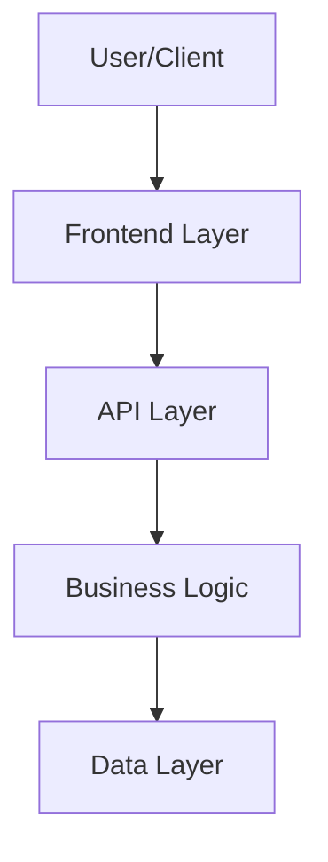

<!--
Technical implementation plans live at: .github/specs/<kebab-case-name>/plan.md

This plan provides HIGH-LEVEL strategic guidance for a capable AI agent to implement a feature.
Focus on architecture, approach, patterns, edge cases, and gotchas - NOT detailed implementations.

⚠️ CRITICAL: DO NOT INCLUDE:
- Code fragments, class definitions, or method implementations
- Detailed property lists or method signatures
- Complete validation rules or business logic code
- UI component templates or detailed styling

The implementing agent is capable - provide strategic direction, not code.

The plan is organized into milestones (5-10 files each) that can be independently verified.
Implementation agents should mark milestones as complete as they progress through the work.
-->

# Technical Implementation Plan: <feature-name>

## 1. Architecture & Strategy

### System Context
<2-3 sentences: How this feature fits into the overall system and interacts with existing features>

### Architecture Diagram

### Key Design Decisions
- **<Decision 1>**: <Rationale and alternatives considered>
- **<Decision 2>**: <Rationale and alternatives considered>

### Data Flow Summary
<High-level description of how data flows through the system, including key transformations and side effects>

### Critical Patterns & Conventions

**Backend**:
<Patterns the implementing agent should follow, e.g.:>
- MediatR CQRS pattern for all operations (Command/Query + Handler)
- FluentValidation for input validation
- JWT authentication via `[Authorize]` attribute
- Unit tests in `backend/tests/Conduit.UnitTests/` mirroring feature structure
- Integration tests in `backend/tests/Conduit.IntegrationTests/`
- Migration management via EF Core Migrations (executed automatically at startup)

**Frontend**:
<Patterns the implementing agent should follow, e.g.:>
- Angular signals for reactive state management
- Standalone components with explicit imports
- Co-located unit tests (`.test.ts` files alongside source)
- RxJS observables for async operations
- Service-based API integration

---

## 2. Implementation Milestones

> **Instructions for Implementation Agent**: 
> Work through milestones sequentially. Mark files complete as you create/modify them.
> After each milestone, run the verification steps before proceeding.

### Milestone 1: <Descriptive Name>
**Goal**: <One sentence describing what this milestone achieves>

**Scope** (~5-10 files):
- [ ] `backend/src/Conduit/Domain/<Entity>.cs` - <Brief purpose>
- [ ] `backend/src/Conduit/Infrastructure/ConduitContext.cs` - <What changes>
- [ ] `backend/tests/Conduit.UnitTests/Domain/<Tests>.cs` - <Test coverage>
- [ ] ...

**Implementation Guidance**:
- <High-level approach or pattern to use>
- **Watch out for**: <Potential pitfall or edge case>
- <Any non-obvious considerations>

**Verification**:
- [ ] `dotnet build backend/src/Conduit/` succeeds
- [ ] Unit tests in `backend/tests/Conduit.UnitTests/` pass
- [ ] <Specific behavior to manually verify, if applicable>

---

### Milestone 2: <Descriptive Name>
**Goal**: <One sentence describing what this milestone achieves>

**Scope** (~5-10 files):
- [ ] `backend/src/Conduit/Features/<Feature>/<Command>.cs` - <Purpose>
- [ ] `backend/src/Conduit/Features/<Feature>/<Validator>.cs` - <Validation rules>
- [ ] `backend/src/Conduit/Features/<Feature>/<Handler>.cs` - <Business logic>
- [ ] `backend/tests/Conduit.UnitTests/Features/<Feature>/<Tests>.cs` - <Test coverage>
- [ ] ...

**Implementation Guidance**:
- <High-level approach>
- **Edge Cases**: <Critical edge cases to handle>
- **Watch out for**: <Potential pitfall>

**Verification**:
- [ ] `dotnet build backend/src/Conduit/` succeeds
- [ ] All unit tests pass
- [ ] <Specific behavior to verify>

---

### Milestone 3: <Descriptive Name>
**Goal**: <One sentence>

**Scope** (~5-10 files):
- [ ] `frontend/src/app/core/services/<service>.service.ts` - <Purpose>
- [ ] `frontend/src/app/core/services/<service>.service.test.ts` - <Test coverage>
- [ ] `frontend/src/app/features/<feature>/components/<component>.component.ts` - <UI component>
- [ ] `frontend/src/app/features/<feature>/components/<component>.component.test.ts` - <Tests>
- [ ] ...

**Implementation Guidance**:
- <Approach for state management, API integration, etc.>
- **UI Patterns**: <Any specific UI patterns or components to use>
- **Watch out for**: <Frontend-specific pitfalls>

**Verification**:
- [ ] `npm run build` succeeds (from frontend/)
- [ ] `npm run test` passes
- [ ] <Manual verification if needed>

---

### Milestone 4: <Integration Tests>
**Goal**: Add integration tests for end-to-end scenarios

**Scope** (~5-10 files):
- [ ] `backend/tests/Conduit.IntegrationTests/Features/<Feature>/<Test>.cs` - <Scenario>
- [ ] ...

**Implementation Guidance**:
- Test full request/response cycles
- Cover authentication/authorization
- Verify database state changes
- **Critical Scenarios**: <Most important flows to test>

**Verification**:
- [ ] `dotnet test backend/tests/Conduit.IntegrationTests/` passes
- [ ] All integration test scenarios pass

---

## 3. Cross-Cutting Concerns

### Edge Cases & Pitfalls
<List critical edge cases that span multiple milestones or are easy to miss>

**Authentication/Authorization**:
- <Edge cases related to auth>

**Data Integrity**:
- <Edge cases related to data consistency>

**Concurrency**:
- <Edge cases related to race conditions, if applicable>

### Performance Considerations
<Any performance concerns the agent should be aware of, if applicable>

### Security Considerations
<Any security concerns beyond standard auth, if applicable>

---

## 4. Final Verification

> **Complete this checklist after all milestones are done**

### Build Verification
- [ ] Backend builds: `cd backend; dotnet build Conduit.sln` succeeds (0 errors)
- [ ] Backend unit tests: `cd backend; dotnet test tests/Conduit.UnitTests/` passes (all tests)
- [ ] Backend integration tests: `cd backend; dotnet test tests/Conduit.IntegrationTests/` passes (all tests)
- [ ] Frontend builds: `cd frontend; npm run build` succeeds (0 errors)
- [ ] Frontend unit tests: `cd frontend; npm run test` passes (all tests)

### Functional Verification
<List 3-5 key user flows that should work end-to-end>
- [ ] <User can [do X]>
- [ ] <User can [do Y]>
- [ ] <Edge case Z is handled correctly>

### Regression Check
- [ ] No existing tests are broken
- [ ] No regressions in related features

---

## 5. Dependencies & References

### Depends On
<List features or components this feature requires, if any>

### Depended On By
<List features that will build on this feature, if any>

### Related Documentation
- Feature spec: `.github/specs/<kebab-case-name>/spec.md`
- Related features: <list if applicable>

---

## Notes for Implementation Agent

<Any additional strategic guidance, gotchas, or context that doesn't fit above.
Keep this section short and high-level.>
