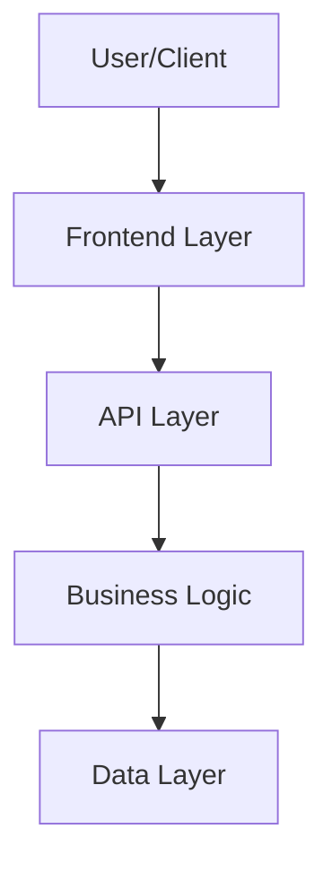

<!--
Technical implementation plans live at: .github/specs/<kebab-case-name>/plan.md

This plan provides HIGH-LEVEL strategic guidance for a capable AI agent to implement a feature.
Focus on architecture, approach, patterns, edge cases, and gotchas - NOT written out classes.

⚠️ CRITICAL: DO NOT INCLUDE:
- Full class or method implementations in code
- UI component templates or detailed styling

-->

# Technical Implementation Plan: <feature-name>

## 1. Architecture & Strategy

### System Context
<2-3 sentences: How this feature fits into the overall system and interacts with existing features>

### Architecture Diagram

### Key Design Decisions
- **<Decision 1>**: <Rationale and alternatives considered>
- **<Decision 2>**: <Rationale and alternatives considered>

### Data Flow Summary
<High-level description of how data flows through the system, including key transformations and side effects>

### Critical Patterns & Conventions

**Backend**:
<Patterns the implementing agent should follow, e.g.:>
- MediatR CQRS pattern for all operations (Command/Query + Handler)
- FluentValidation for input validation
- JWT authentication via `[Authorize]` attribute
- Unit tests in `backend/tests/Conduit.UnitTests/` mirroring feature structure
- Integration tests in `backend/tests/Conduit.IntegrationTests/`

**Frontend**:
<Patterns the implementing agent should follow, e.g.:>
- Angular signals for reactive state management
- Standalone components with explicit imports
- Co-located unit tests (`.test.ts` files alongside source)
- RxJS observables for async operations
- Service-based API integration

---

## 2. Subtasks
<Break down the feature into subtasks. Each subtask should consist of creating one file, its test file and a description of relevant edge cases and pitfalls>

---
## 3. Cross-Cutting Concerns

### Edge Cases & Pitfalls
<List critical edge cases that span multiple milestones or are easy to miss>

**Authentication/Authorization**:
- <Edge cases related to auth>

**Data Integrity**:
- <Edge cases related to data consistency>

**Concurrency**:
- <Edge cases related to race conditions, if applicable>

### Performance Considerations
<Any performance concerns the agent should be aware of, if applicable>

### Security Considerations
<Any security concerns beyond standard auth, if applicable>

---

## 4. Final Verification

> **Complete this checklist after all milestones are done**

### Build Verification
- [ ] Backend builds: `cd backend; dotnet build Conduit.sln` succeeds (0 errors)
- [ ] Backend unit tests: `cd backend; dotnet test tests/Conduit.UnitTests/` passes (all tests)
- [ ] Backend integration tests: `cd backend; dotnet test tests/Conduit.IntegrationTests/` passes (all tests)
- [ ] Frontend builds: `cd frontend; npm run build` succeeds (0 errors)
- [ ] Frontend unit tests: `cd frontend; npm run test` passes (all tests)

### Functional Verification
<List 3-5 key user flows that should work end-to-end>
- [ ] <User can [do X]>
- [ ] <User can [do Y]>
- [ ] <Edge case Z is handled correctly>

### Regression Check
- [ ] No existing tests are broken

---

## 5. Dependencies & References

### Depends On
<List features or components this feature requires, if any>

### Depended On By
<List features that will build on this feature, if any>

### Related Documentation
- Feature spec: `.github/specs/<kebab-case-name>/spec.md`
- Related features: <list if applicable>

