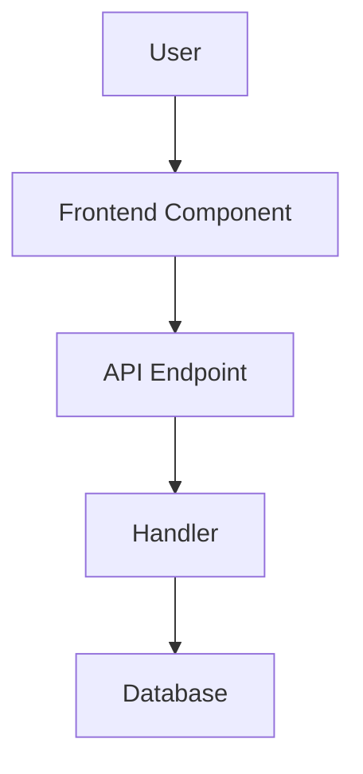

<!--
Technical implementation plans live at: .github/specs/<kebab-case-name>/plan.md
This plan should be written by a senior developer/architect for medior developers to implement.
Be specific about what needs to change, but keep it concise and high-level.
-->

# Technical Implementation Plan: <feature-name>

## 1) Architecture Overview

### System Context
<Brief description of how this feature fits into the overall system>

### Architecture Diagram


### Key Design Decisions
- <Decision 1 with rationale>
- <Decision 2 with rationale>

### Data Flow
1. <User action> → 2. <Frontend processing> → 3. <API call> → 4. <Backend processing> → 5. <Database operation> → 6. <Response>

## 2) Backend Implementation

### Domain Layer Changes
- **Entities**: `backend/src/Conduit/Domain/<EntityName>.cs`
  - Properties: <list key properties>
  - Relationships: <describe relationships>
  
- **Database Context**: `backend/src/Conduit/Infrastructure/ConduitContext.cs`
  - Add `DbSet<EntityName>`
  - Configure relationships, cascade deletes, indexes in `OnModelCreating`

### Command/Query Handlers
- **Create**: `backend/src/Conduit/Features/<FeatureName>/<Action>.cs`
  - Command/Query properties: <list>
  - Handler logic: <describe main logic>
  - Database operations: <describe>
  - Response: <DTO type>

### Validators
- **Create**: `backend/src/Conduit/Features/<FeatureName>/<Action>Validator.cs`
  - Validation rules: <list key rules>

### DTOs
- **Create**: Response models in feature folder
  - <List DTO files and their purpose>

### Controller Endpoints
- **Create/Modify**: `backend/src/Conduit/Features/<FeatureName>/<Controller>.cs`
  - `[Http<Method>] api/<route>`
  - Authorization: `[Authorize]` or none
  - Request/Response types
  - Status codes: <list>

### Infrastructure
- **Services** (if needed): `backend/src/Conduit/Infrastructure/<ServiceName>.cs`
  - Register in `ServicesExtensions.cs`
- **Configuration** (if needed): Update `Program.cs`

### Database Migration
```bash
cd backend/src/Conduit
dotnet ef migrations add <MigrationName>
```

### Tests
- **Unit Tests**: `backend/tests/Conduit.UnitTests/Features/<FeatureName>/`
  - Validator tests: test all validation rules
  - Handler tests: test happy path, error cases, business logic
  
- **Integration Tests**: `backend/tests/Conduit.IntegrationTests/Features/<FeatureName>/`
  - Test full request/response cycle, auth, database changes

## 3) Frontend Implementation

### Components
- **New**: `frontend/src/components/<ComponentName>.jsx` + `.test.jsx`
  - Props: <list>
  - Behavior: <describe>
  - Export in `index.js`
  
- **Modify**: `frontend/src/components/<ExistingComponent>.jsx`
  - Changes: <describe>

### Pages & Routing
- **New Page**: `frontend/src/pages/<PageName>.jsx` + `.test.jsx`
  - Route: `/<route>` (Public / `<AuthRoute>` / `<GuestRoute>`)
  - Components used: <list>
  - Export in `index.jsx`
  
- **Routing**: Update `frontend/src/App.jsx` with new route
- **Navigation**: Update `frontend/src/components/Navbar.jsx` if needed

### State Management
- **Query Hooks**: `frontend/src/hooks/use<Feature>Query.js`
  - Endpoint: `GET /<endpoint>`
  - Query key: `['<feature>', ...]`
  - Export in `index.js`
  
- **Mutation Hooks**: `frontend/src/hooks/use<Action>Mutation.js`
  - Endpoint: `<METHOD> /<endpoint>`
  - Cache invalidation: <query keys to invalidate>
  - Optimistic updates: <if applicable>
  - Export in `index.js`

### Data Models (if needed)
- **Create**: `frontend/src/models/<ModelName>.js`
  - Data transformations between API and frontend
  - Export in `index.js`

### API Integration
- **Agent**: Update `frontend/src/services/agent.js` with new methods
- **Mock Server**: Update `frontend/src/server.js`
  - Add models, factories, seeds
  - Add route handlers for new endpoints

### Forms & UI
- **Forms**: Implement with validation, error handling (422 responses)
- **Styles**: Update `frontend/src/App.css`
- **States**: Implement loading, empty, and error states
- **Accessibility**: Add ARIA labels, keyboard navigation

### Dependencies (if needed)
- Update `frontend/package.json` and run `npm install`

## 4) Validation & Testing

### Backend Validation

**REQUIRED: The backend MUST build and all tests MUST pass before proceeding.**

1. **Build the solution**:
   ```bash
   cd backend
   dotnet build Conduit.sln
   ```
   Fix all build errors until clean build succeeds (0 errors).

2. **Run all unit tests**:
   ```bash
   cd backend
   dotnet test tests/Conduit.UnitTests/Conduit.UnitTests.csproj
   ```
   Fix all test failures until all tests pass. Ensure new code has adequate test coverage (aim for 80%+).

3. **Run all integration tests**:
   ```bash
   cd backend
   dotnet test tests/Conduit.IntegrationTests/Conduit.IntegrationTests.csproj
   ```
   Fix all test failures until all tests pass.

### Frontend Validation

**REQUIRED: The frontend MUST build and all tests MUST pass before proceeding.**

1. **Build the frontend**:
   ```bash
   cd frontend
   npm run build
   ```
   Fix all build errors until clean build succeeds.

3. **Run all unit tests**:
   ```bash
   cd frontend
   npm test
   ```
   Fix all test failures until all tests pass. Ensure new components have unit tests.

### Final Verification

**Before considering implementation complete, ensure:**

1. ✅ Backend builds with zero errors
2. ✅ All backend unit tests pass
3. ✅ All backend integration tests pass
4. ✅ Frontend builds with zero errors
5. ✅ All frontend unit tests pass
6. ✅ Manual testing confirms feature works as specified
7. ✅ No regressions in existing functionality

## 5) Implementation Notes

### Development Order
1. <Backend domain layer>
2. <Backend feature implementation>
3. <Backend tests>
4. <Frontend components>
5. <Frontend integration>
6. <Frontend tests>

### Dependencies / Prerequisites
- <List any dependencies>

### References
- Feature spec: `.github/specs/<kebab-case-name>/spec.md`
- Related features: <list if applicable>
