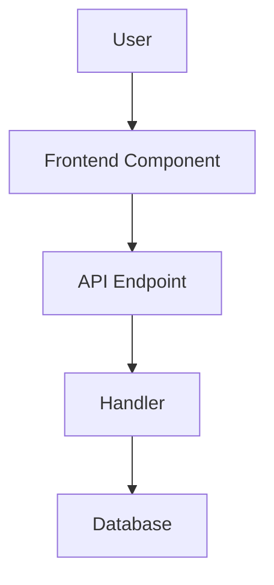

<!--
Technical implementation plans live at: .github/specs/<kebab-case-name>/plan.md
This plan is written for senior developers to implement a feature.
Focus on architecture, edge cases, pitfalls, and dependencies - not implementation details.
-->

# Technical Implementation Plan: <feature-name>

## 1) Architecture Overview

### System Context
<Brief description of how this feature fits into the overall system and interacts with existing features>

### Architecture Diagram


### Key Design Decisions
- <Decision 1 with rationale - why this approach vs alternatives>
- <Decision 2 with rationale>

### Data Flow
<Describe the end-to-end data flow, including any transformations, validations, or side effects>

## 2) Backend Implementation

### Domain Layer
**Entities**: `backend/src/Conduit/Domain/<EntityName>.cs`
- New/modified entities and their key properties
- Relationships and navigation properties
- **Database Context**: Update `ConduitContext.cs` with DbSet and relationship configuration (cascade behavior, indexes)
- **Migration**: Generate migration after domain changes

### Features
**Location**: `backend/src/Conduit/Features/<FeatureName>/`

Implement the following operations:
- <Operation 1>: `[HttpMethod] api/<route>` - <brief description>
- <Operation 2>: `[HttpMethod] api/<route>` - <brief description>

Each operation needs:
- Command/Query with MediatR handler
- FluentValidation validator
- Response DTO(s)
- Controller endpoint (authorization: `[Authorize]` or public)

**Complex Business Logic** (if applicable):
<If there's complex logic, provide pseudocode or detailed explanation>

### Edge Cases & Pitfalls
- <Edge case 1 and how to handle>
- <Edge case 2 and how to handle>
- <Potential pitfall and how to avoid>

### Testing Requirements
**Unit Tests**: `backend/tests/Conduit.UnitTests/Features/<FeatureName>/`
- Validator tests for all validation rules
- Handler tests for business logic and database interactions
- Important edge cases: <list critical scenarios>

**Integration Tests**: `backend/tests/Conduit.IntegrationTests/Features/<FeatureName>/`
- Full request/response cycle
- Authentication/authorization
- Database state changes
- Critical edge cases: <list if any>

## 3) Frontend Implementation

### Components
**New Components**: `frontend/src/components/`
- `<ComponentName>.jsx` + `.test.jsx` - <purpose>
- Export in `index.js`

**Modified Components**:
- `<ExistingComponent>.jsx` - <what changes and why>

### Pages & Routing
**New Pages**: `frontend/src/pages/`
- `<PageName>.jsx` + `.test.jsx`
- Route: `/<route>` (route type: Public / `<AuthRoute>` / `<GuestRoute>`)
- Update `App.jsx` routing
- Update `Navbar.jsx` navigation (if needed)

### State Management
**Query Hooks**: `frontend/src/hooks/`
- `use<Feature>Query.js` - <endpoint and purpose>
- Export in `index.js`

**Mutation Hooks**: `frontend/src/hooks/`
- `use<Action>Mutation.js` - <endpoint and purpose>
- Cache invalidation: <which query keys to invalidate>
- Optimistic updates: <if applicable, describe the approach>
- Export in `index.js`

### API Integration
**Agent**: Update `frontend/src/services/agent.js`
- Add methods for new endpoints: <list methods>

**MirageJS Mock Server**: Update `frontend/src/server.js`
- Add/update models: <model definitions>
- Add factories: <factory configurations>
- Add seeds: <seed data for development>
- Add route handlers: <endpoint handlers>

### UI/UX Considerations
- Form validation and error handling (422 responses)
- Loading states, empty states, error states
- Update `App.css` if new styles needed
- Accessibility considerations (ARIA labels, keyboard navigation)

### Edge Cases & Pitfalls
- <Edge case 1 and how to handle in UI>
- <Edge case 2 and how to handle in UI>

### Testing Requirements
**Unit Tests**: Co-located `.test.jsx` files
- Component rendering and behavior
- User interactions
- Important edge cases: <list critical scenarios>

## 4) Validation & Testing

**Backend**:
```bash
cd backend
dotnet build Conduit.sln                                          # Must succeed
dotnet test tests/Conduit.UnitTests/                              # All pass
dotnet test tests/Conduit.IntegrationTests/                       # All pass
```

**Frontend**:
```bash
cd frontend
npm run build                                                     # Must succeed
npm test                                                          # All pass
```

**Checklist**:
- ✅ Backend builds (0 errors)
- ✅ All backend unit tests pass
- ✅ All backend integration tests pass
- ✅ Frontend builds (0 errors)
- ✅ All frontend unit tests pass
- ✅ Manual testing confirms feature works as specified
- ✅ No regressions in existing functionality

## 5) Implementation Notes

### Dependencies
- <List any dependencies on other features or external systems>
- <List any feature dependencies that depend on this>

### Critical Implementation Order (if applicable)
<Only include if there's a critical order to implementation steps, otherwise omit>

### References
- Feature spec: `.github/specs/<kebab-case-name>/spec.md`
- Related features: <list if applicable>
